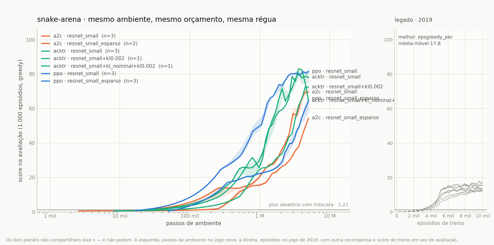

<a name="topo"></a>

<div align="center">

# 🐍 snake-arena

**Um benchmark reprodutível de algoritmos de Reinforcement Learning no Snake.**

Todos em Keras 3. Todos no mesmo ambiente. Todos no mesmo gráfico.

[](LICENSE)
[](https://keras.io/)
[](https://www.tensorflow.org/)
[](#roteiro)

</div>

> **Estado atual: em construção.** A estrutura e o contrato de comparabilidade estão definidos; os
> algoritmos estão sendo portados. Este README não contém nenhum número inventado — a tabela de
> resultados só será preenchida com execuções reais, e as células vazias são vazias de propósito.

---

## Sumário

- [Por que este repositório existe](#por-que)
- [Relação com os repositórios antigos](#antigos)
- [O contrato de comparabilidade](#contrato)
- [Algoritmos](#algoritmos)
- [Resultados](#resultados)
- [Estrutura do projeto](#estrutura)
- [Como usar](#como-usar)
- [Notas de porte para Keras 3](#keras3)
- [Referências](#referencias)
- [Roteiro](#roteiro)
- [Créditos e licença](#creditos)

---

<a name="por-que"></a>
## Por que este repositório existe

Entre 2018 e 2023 eu acumulei treze notebooks de Snake com RL espalhados por duas pastas chamadas
`Working` e `Not Working`. Eles tinham DQN com todas as variações do Rainbow, ACER, experimentos com
o otimizador K-FAC — e nenhum deles era comparável com nenhum outro. Cada um media uma coisa
diferente, num ambiente ligeiramente diferente, e onze dos treze terminavam com uma exceção na
última execução salva.

O gatilho foi reescrever o agente em **PPO com Keras 3**, sobre um ambiente vetorizado em NumPy.
Ele funcionou — e aí veio a pergunta óbvia: *funcionou melhor que o quê?* Não dava para responder.
As curvas antigas do DQN registravam o **comprimento da cobra** (que começa em 3), a curva nova
registrava o **score** (que começa em 0), e o jogo por baixo das duas não era o mesmo.

Este repositório é a resposta: um lugar onde cada algoritmo é implementado em Keras 3, roda no mesmo
ambiente, sob o mesmo orçamento, é avaliado pelo mesmo protocolo — e as curvas podem, finalmente,
ser postas lado a lado sem asterisco.

<p align="right">(<a href="#topo">voltar ao topo</a>)</p>

---

<a name="antigos"></a>
## Relação com os repositórios antigos

Este repositório **não apaga** os anteriores. Ele os sucede, e carrega junto o que eles produziram
de aproveitável.

| Repositório | O que era | O que acontece com ele |
|---|---|---|
| [**voaneves/snake-on-pygame**](https://github.com/voaneves/snake-on-pygame) | O jogo em pygame, jogável por humanos, com uma API no estilo gym para agentes e um leaderboard humano em `resources/scores.json` | **Continua vivo** como o jogo. Vira dependência opcional daqui: renderização e o duelo humano × agente. O leaderboard passa a usar a mesma métrica do benchmark |
| [**voaneves/colab-rl**](https://github.com/voaneves/colab-rl) | Implementações Keras de DQN e família (TF1/Keras 1.x) + 13 notebooks de Snake + modelos de benchmark | **A parte de RL migra para cá.** Os 13 notebooks são preservados em [`legacy/`](legacy/) com o motivo exato da falha documentado; os CSVs de treino viram séries históricas em [`results/legacy/`](results/legacy/). O repo original permanece como acervo de notebooks diversos |

### O que foi resgatado do acervo

Seis CSVs de **10.000 épocas** de treino de DQN sobreviveram, cobrindo `experience replay` e
`prioritized experience replay`, com e sem `double`, `dueling` e retornos de `n` passos. Eles não são
comparáveis com o benchmark novo — foram medidos em outro ambiente — mas são convertidos
(`score = comprimento − 3`) e aparecem no gráfico da arena como **linhas tracejadas cinza**, com a
ressalva no rótulo. História merece ser plotada, só não merece competir.

### O que foi aprendido ao autopsiar o código antigo

Três defeitos no ambiente original ajudam a explicar por que aquelas curvas saturavam cedo. Estão
listados aqui porque são a justificativa técnica do ambiente novo:

1. **A cabeça sumia do estado.** Em `state()`, a posição da cabeça era escrita e logo em seguida
   sobrescrita pelo laço que desenha o corpo. A rede via um blob indistinto — nunca soube para onde
   a cobra estava olhando.
2. **A recompensa não era estacionária.** Comer devolvia `+comprimento` (4, 5, 6, … 30) contra `−1`
   de morte. A escala do alvo de Q crescia dentro do próprio episódio.
3. **A dica de segurança destruía o tabuleiro.** A heurística de perigo escrevia seus três booleanos
   na **última linha** do canvas, apagando o conteúdo real daquelas células e colocando informação
   não-espacial na entrada de uma convolução.

Some a isso um canal único com codificação ordinal (`comida=1 < corpo=2 < cabeça=3`), que faz a
convolução ler categoria como magnitude, e o platô deixa de ser mistério.

<p align="right">(<a href="#topo">voltar ao topo</a>)</p>

---

<a name="contrato"></a>
## O contrato de comparabilidade

Esta é a regra central do repositório: **nenhum resultado entra no gráfico se não obedecer a esta
tabela.** Há um validador em `snakeai/record.py` e um teste que o aplica a todo `history.json`.

| Item | Valor fixado |
|---|---|
| Ambiente | `VecSnake` — N tabuleiros em paralelo, NumPy puro, sem pygame |
| Tabuleiro | 10 × 10, `starve_base = 100` passos desde a última comida |
| Observação | 5 canais egocêntricos `(B, B, 5)`: corpo, cabeça, decaimento de cauda, comida, comprimento |
| Ações | 3 relativas (esquerda, reto, direita) com máscara de morte imediata |
| Recompensa | `+1` comer · `−1` morrer · `0` passo · shaping potencial decaindo a zero em 25% do treino |
| **Métrica** | `score` = comida comida, começando em **0**. Nunca comprimento |
| Piso de referência | política aleatória **com máscara** = **1,21** (medido, 1.000 episódios × 5 sementes, desvio 0,06) |
| Teto | **97** — score perfeito num 10 × 10 |
| Orçamento | o **mesmo número de passos de ambiente** para todos. Episódios são reportados, nunca usados como orçamento |
| Avaliação | 1.000 episódios, política greedy, `seed=123`, **sem** filtro de segurança |
| Filtro de segurança | coluna separada da tabela — é pós-processamento, não política aprendida |
| Sementes | 3 por configuração. Curva = mediana, banda = intervalo interquartil |
| Registro | `runs/<algo>/<variante>/seed<N>/history.json`, esquema único |

**Por que o piso subiu de 1,08 para 1,21.** O número antigo veio da forma ingênua de avaliar:
rodar N ambientes e parar assim que 1.000 episódios terminassem. Isso **subestima qualquer agente**,
porque episódios curtos terminam primeiro e entram na amostra, enquanto os longos — que são os bons —
ainda estão correndo quando a contagem fecha. Quanto melhor o agente, maior o viés. O `evaluate`
deste repositório faz cada ambiente contribuir com o mesmo número de episódios, o que elimina a
distorção. O piso corrigido é **1,21 ± 0,06** (5 sementes), e a mesma correção vale para todos os
algoritmos — que é o ponto.

**Por que passos e não episódios.** O repositório antigo media em épocas (`NB_EPOCH = 10000`). Com
centenas de ambientes em paralelo, "episódio" deixa de ser unidade de tempo — e pior, ele encolhe
conforme o agente melhora: no início são ~200 passos por episódio, com score ~50 já são ~700. Medir
em episódios premia quem morre rápido. O eixo oficial é passo de ambiente; o número de episódios vai
junto no registro, para quem quiser a leitura antiga.

<p align="right">(<a href="#topo">voltar ao topo</a>)</p>

---

<a name="algoritmos"></a>
## Algoritmos

**Doze algoritmos**, todos reimplementados em **Keras 3**, sobre o mesmo ambiente, o mesmo
orçamento e a mesma API de agente. A bibliografia completa — cada peça, cada componente e o
teste que prova que a implementação faz o que o paper diz — está em
[`docs/REFERENCIAS.md`](docs/REFERENCIAS.md).

| Algoritmo | Paper | Notebook | Origem | Estado |
|---|:---:|---|---|---|
| **PPO** — clipping, GAE(λ), value clipping, early stop por KL | [📎](https://arxiv.org/abs/1707.06347) | `01_ppo.ipynb` | novo, é a referência | ✅ implementado, 19 testes |
| **DQN** — família unificada: ER/PER, double, dueling, n-step, noisy, C51 | [📎](https://arxiv.org/abs/1312.5602) | `02_dqn.ipynb` | 6 notebooks do `colab-rl` | ✅ implementado, 8 variantes testadas |
| **Rainbow** — os seis componentes juntos | [📎](https://arxiv.org/abs/1710.02298) | `03_rainbow.ipynb` | novo | ✅ algoritmo próprio, com linha própria na arena |
| **A2C** — actor-critic síncrono, o controle experimental do PPO | [📎](https://arxiv.org/abs/1602.01783) | `04_a2c.ipynb` | prometido no `colab-rl`, nunca escrito | ✅ implementado, com o `t_max=5` canônico do A3C |
| **ACER** — Retrace(λ), IS truncado com correção de viés, região de confiança | [📎](https://arxiv.org/abs/1611.01224) | `05_acer.ipynb` | 2 notebooks quebrados | ✅ reescrito e **convergindo** (16,8 em 151k passos) |
| **AlphaZero** — MCTS sobre o simulador real | [📎](https://arxiv.org/abs/1712.01815) | `06_alphazero.ipynb` | novo | ✅ implementado, e **reconstruído** depois que a primeira execução de 5 M revelou três defeitos somados (§2.27–§2.29): a busca que só confirmava a rede, o alvo de valor que dominava o tronco, e a temperatura que virava rótulo duro. Os onze consertos são o padrão; a versão anterior virou o braço `sem_correcoes` do `93`. Ver [`docs/BUSCA_DEGENERADA.md`](docs/BUSCA_DEGENERADA.md) |
| **MuZero** — a mesma busca, sobre um modelo aprendido | [📎](https://arxiv.org/abs/1911.08265) | `07_muzero.ipynb` | novo | ✅ implementado |
| **ACKTR** — A2C com gradiente natural via K-FAC e região de confiança | [📎](https://arxiv.org/abs/1708.05144) | `08_acktr.ipynb` | 4 notebooks quebrados | ✅ K-FAC em Keras 3, região **calibrada** por padrão, 19 testes de curvatura |
| **ACEKTR** — ACKTR com EK-FAC: a base do K-FAC, os autovalores **medidos** | [📎](https://arxiv.org/abs/1806.03884) | `12_acektr.ipynb` | novo | ✅ implementado, 21 testes; com a medição desligada é **bit a bit** o ACKTR |
| **DreamerV3** — modelo do mundo, ator treinado no sonho | [📎](https://arxiv.org/abs/2301.04104) | `09_dreamerv3.ipynb` | novo | ✅ RSSM categórico, symlog, two-hot, 28 testes |
| **LBC** — controle de comportamento aprendido: mistura de Boltzmann sobre uma população, V-trace, seleção por bandit | [📎](https://arxiv.org/abs/2305.05239) | `10_lbc.ipynb` | novo | ✅ implementado, 44 testes (agente + meta-controlador) |
| **SOAP** — opções discretas com crença para a frente, vantagem de opção propagada | [📎](https://arxiv.org/abs/2407.18913) | `11_soap.ipynb` | novo | ✅ implementado, 24 testes; com `n_opcoes=1` **é** o PPO, e o teste prova |
| ↳ **ACKTR sem calibrar** — `kl_max` volta a ser alvo nominal | — | `98_acktr_kl_nominal.ipynb` | — | ✅ braço de controle: a mesma semente deu 83,91 e 64,53 em hardwares diferentes |
| ↳ **Rainbow com a janela de 3** — o `n_steps` canônico do paper | — | `94_rainbow_nstep3.ipynb` | — | ✅ braço de controle: **0,57 contra 65,43**, e 100% dos episódios terminando por fome |
| ↳ **PPO com o orçamento antigo** — ~2.400 atualizações em vez de ~38.300 | — | `96_ppo_orcamento_esparso.ipynb` | — | ✅ braço de controle da ablação de orçamento |
| ↳ **A2C com o rollout antigo** — ~610 atualizações em vez de ~1.953 | — | `95_a2c_orcamento_esparso.ipynb` | — | ✅ a mesma ablação com **um** botão só, fora da família PPO |
| ↳ **PPO com o sexto canal** — a observação passa a ver o relógio da fome | — | `97_ppo_canal_de_fome.ipynb` | — | ⚠️ `comparable=False`: muda a entrada da rede, não divide eixo com as curvas de 5 canais |
| ↳ **AlphaZero — quanto cada conserto valeu** | — | `93_alphazero_ablacoes.ipynb` | — | 🔬 17 braços que **removem** um conserto do padrão, um por vez, como o `98` faz com o `08`. Três deles removem um mecanismo inteiro (§2.27, §2.28, §2.29) e respondem a pergunta em três execuções; `sem_correcoes` reproduz o agente anterior. Comparar com `06_alphazero` na mesma semente |
| ↳ **eixo de otimizadores** (primeira ordem) | — | `99_ablacoes.ipynb` | — | ✅ Adam, AdamW, RMSprop, Lion e SGD como ablação medida |

<details>
<summary><b>Referências completas</b> — e as peças que não têm linha própria na tabela</summary>

Cada 📎 acima aponta para o paper que **define** o algoritmo. Várias implementações daqui
compõem mais de um trabalho, e as linhas `↳` são ablações deste repositório, não algoritmos
publicados — por isso não têm paper. A lista completa:

| Peça | Onde é usada | Paper |
|---|---|---|
| PPO | `01`, e o rollout que o A2C e o ACKTR herdam | Schulman et al., 2017 — *Proximal Policy Optimization Algorithms* [📎](https://arxiv.org/abs/1707.06347) |
| GAE(λ) | vantagem do PPO, A2C, ACKTR | Schulman et al., 2015 — *High-Dimensional Continuous Control Using Generalized Advantage Estimation* [📎](https://arxiv.org/abs/1506.02438) |
| DQN | `02`, base do Rainbow | Mnih et al., 2013 — *Playing Atari with Deep Reinforcement Learning* [📎](https://arxiv.org/abs/1312.5602) · versão Nature 2015 [📎](https://www.nature.com/articles/nature14236) |
| Double Q-learning | flag `double` | van Hasselt et al., 2015 — *Deep Reinforcement Learning with Double Q-learning* [📎](https://arxiv.org/abs/1509.06461) |
| Dueling | flag `dueling` | Wang et al., 2015 — *Dueling Network Architectures for Deep Reinforcement Learning* [📎](https://arxiv.org/abs/1511.06581) |
| Prioritized replay | flag `per` | Schaul et al., 2015 — *Prioritized Experience Replay* [📎](https://arxiv.org/abs/1511.05952) |
| C51 (RL distribucional) | flag `c51`, e o mesmo motivo do two-hot do Dreamer | Bellemare et al., 2017 — *A Distributional Perspective on Reinforcement Learning* [📎](https://arxiv.org/abs/1707.06887) |
| NoisyNet | flag `noisy` | Fortunato et al., 2017 — *Noisy Networks for Exploration* [📎](https://arxiv.org/abs/1706.10295) |
| Rainbow | `03` — a composição canônica das seis | Hessel et al., 2017 — *Rainbow: Combining Improvements in Deep Reinforcement Learning* [📎](https://arxiv.org/abs/1710.02298) |
| A3C / A2C | `04` | Mnih et al., 2016 — *Asynchronous Methods for Deep Reinforcement Learning* [📎](https://arxiv.org/abs/1602.01783) |
| ACER | `05` | Wang et al., 2016 — *Sample Efficient Actor-Critic with Experience Replay* [📎](https://arxiv.org/abs/1611.01224) |
| Retrace(λ) | o estimador off-policy do ACER | Munos et al., 2016 — *Safe and Efficient Off-Policy Reinforcement Learning* [📎](https://arxiv.org/abs/1606.02647) |
| AlphaZero | `06` | Silver et al., 2017 — *Mastering Chess and Shogi by Self-Play with a General Reinforcement Learning Algorithm* [📎](https://arxiv.org/abs/1712.01815) |
| MuZero | `07` | Schrittwieser et al., 2019 — *Mastering Atari, Go, Chess and Shogi by Planning with a Learned Model* [📎](https://arxiv.org/abs/1911.08265) |
| ACKTR | `08`, `98` | Wu et al., 2017 — *Scalable trust-region method for deep reinforcement learning using Kronecker-factored approximation* [📎](https://arxiv.org/abs/1708.05144) |
| K-FAC | `snakeai/kfac.py` — as camadas densas | Martens & Grosse, 2015 — *Optimizing Neural Networks with Kronecker-factored Approximate Curvature* [📎](https://arxiv.org/abs/1503.05671) |
| KFC | `snakeai/kfac.py` — as convoluções | Grosse & Martens, 2016 — *A Kronecker-factored Approximate Fisher Matrix for Convolution Layers* [📎](https://arxiv.org/abs/1602.01407) |
| SOAP | `11` | Ishida & Henriques, 2024 — *SOAP-RL: Sequential Option Advantage Propagation for Reinforcement Learning in POMDP Environments* [📎](https://arxiv.org/abs/2407.18913) |
| Opções / semi-MDP | o arcabouço que o SOAP instancia | Sutton, Precup & Singh, 1999 — *Between MDPs and semi-MDPs: A framework for temporal abstraction in reinforcement learning* [📎](https://doi.org/10.1016/S0004-3702(99)00052-1) |
| Option-Critic | a fatoração que o SOAP substitui | Bacon, Harb & Precup, 2016 — *The Option-Critic Architecture* [📎](https://arxiv.org/abs/1609.05140) |
| LBC | `10` | Fan et al., 2023 — *Learnable Behavior Control: Breaking Atari Human World Records via Sample-Efficient Behavior Selection* [📎](https://arxiv.org/abs/2305.05239) |
| V-trace / IMPALA | o estimador off-policy do LBC | Espeholt et al., 2018 — *IMPALA: Scalable Distributed Deep-RL with Importance Weighted Actor-Learner Architectures* [📎](https://arxiv.org/abs/1802.01561) |
| UCB com janela deslizante | o meta-controlador em `snakeai/bandit.py` | Garivier & Moulines, 2008 — *On Upper-Confidence Bound Policies for Non-Stationary Bandit Problems* [📎](https://arxiv.org/abs/0805.3415) · versão ALT 2011, *Switching Bandit Problems*, é a citada pelo LBC |
| Agent57 | o antecessor que o LBC generaliza | Badia et al., 2020 — *Agent57: Outperforming the Atari Human Benchmark* [📎](https://arxiv.org/abs/2003.13350) |
| EK-FAC | `12`, e a classe `EKFac` em `snakeai/kfac.py` | George, Laurent, Bouthillier, Ballas & Vincent, 2018 — *Fast Approximate Natural Gradient Descent in a Kronecker-factored Eigenbasis* [📎](https://arxiv.org/abs/1806.03884) |
| DreamerV3 | `09` | Hafner et al., 2023 — *Mastering Diverse Domains through World Models* [📎](https://arxiv.org/abs/2301.04104) |

</details>

**Sobre o Rainbow.** Ele não é um algoritmo novo — é o `DQN` deste repositório com as seis
flags ligadas. Existe como classe própria por duas razões, as duas sobre honestidade do
gráfico: teria a cor do DQN e um rótulo `dqn · double+dueling+per+noisy+3steps+c51` que
ninguém lê; e a composição canônica do paper fica no código em vez de depender de quem
configura acertar seis argumentos.

**Sobre o K-FAC.** Quatro notebooks de 2019 tentaram e nenhum roda: dependiam de
`tensorflow.contrib.kfac`, removido no TF2. Ele foi reimplementado do zero em Keras 3
(`snakeai/kfac.py`) — captura de ativações e gradientes de pré-ativação por camada,
amortecimento de Tikhonov fatorado, Cholesky nos dois fatores, e o KFC de Grosse & Martens
para as convoluções. A implementação canônica do Google (`tensorflow/kfac`) foi **arquivada
em 19/04/2026** e usa `tensorflow.compat.v1`, então serviu de referência, não de dependência.

Ele **não** entra no eixo `cfg.optimizer`, e por um motivo estrutural: um
`keras.optimizers.Optimizer` só recebe pares `(gradiente, variável)`, e o K-FAC precisa das
ativações de entrada de cada camada. Ele vive onde o uso é historicamente correto — dentro
do **ACKTR**, que é o `A2C` deste repositório com uma única troca. A diferença entre as duas
curvas na arena é a resposta medida para "vale a pena aproximar a curvatura?", com todo o
resto congelado: mesmo rollout, mesmo GAE, mesma rede.

O que trava a corretude é `tests/test_kfac.py`: com a Fisher exata, **um** passo de tamanho
1 aterrissa no ótimo de mínimos quadrados — o que nenhum método de primeira ordem faz, com
learning rate nenhum. É a diferença entre "implementei K-FAC" e "implementei algo que
pré-condiciona".

**Sobre o EK-FAC.** Ele é a continuação natural do parágrafo acima, e cabe numa frase: o
K-FAC tira duas coisas da fatoração `A ⊗ G = (U_A ⊗ U_G)(S_A ⊗ S_G)(U_A ⊗ U_G)ᵀ` — uma
**base** de autovetores e uma **escala por eixo** —, e só a primeira se justifica. As escalas
são obrigadas a ter forma de produto, `λ_A(j)·λ_G(i)`, e essa restrição não vem de lugar
nenhum além de ter saído junto na conta. O EK-FAC fica com a base e **mede** as escalas: o
segundo momento verdadeiro do gradiente projetado. Pelo Teorema 2 do paper é a melhor escala
diagonal possível naquela base; pelo Teorema 3, nunca é pior que o K-FAC.

E sai barato — o gradiente por amostra de uma camada é um produto externo, e projetar um
produto externo é projetar cada lado, então a média dos quadrados vira **um produto de
matrizes**. (A implementação de referência em PyTorch precisa de um laço sobre o lote; esta
não.)

O que dá sentido à linha na arena é que **o controle é exato**: com `ema_escalas=1` o EK-FAC
não mede nada, `s*` fica no palpite do K-FAC, o amortecimento do apêndice C reproduz o
Tikhonov fatorado dentro da base, e as duas direções coincidem até o arredondamento de
float32. A diferença entre `08_acktr` e `12_acektr` é atribuível à correção de autovalores e
a mais nada. E há uma **previsão falsificável** de brinde: a §região de confiança do ACKTR
documenta um fator sistemático de ~7× entre a KL pedida e a entregue, atribuído a `F̃`
subestimar a curvatura — se esse diagnóstico estiver certo, o EK-FAC tem que encolher o
`kl_fator`. Ver [`docs/EKFAC.md`](docs/EKFAC.md).

**Sobre o DreamerV3.** É o único dos três algoritmos com modelo que não busca nada na hora de agir: AlphaZero e
MuZero gastam computação de inferência em MCTS, o Dreamer usa o modelo só para **treinar**,
em rollouts imaginados. Por isso o número dele na curva é o da política pura, sem asterisco
— a mesma regra que mantém a busca do AlphaZero numa coluna à parte.

**Sobre o SOAP.** Ele existe por causa de um problema que este repositório já tinha
medido e não tinha resolvido: **a observação do contrato não é markoviana**. Os 5 canais não
contêm o relógio da fome, e o limite é `100 + 2·comprimento` passos sem comer — dois estados
visualmente idênticos, um com fome 5 e outro com fome 105, valem coisas diferentes. A
primeira tentativa de resposta foi um sexto canal; ela custou a comparabilidade
(`comparable=False`, a entrada da rede muda) e **não funcionou** — 7,8 pontos abaixo, atrás
em 17 dos 18 pontos de avaliação. Ver [`docs/CANAL_DE_FOME.md`](docs/CANAL_DE_FOME.md).

O SOAP ataca pelo outro lado: em vez de acrescentar informação à observação, dá ao agente um
**latente discreto que atravessa os passos**. São `Z = 4` sub-políticas, uma política de
troca `π_ψ(z'|s,a,z)` — condicionada na opção anterior *e* na ação, que é a fatoração que o
paper propõe contra a do Option-Critic — e uma crença `ζ_t` atualizada pelo filtro para a
frente, usando só o passado. A vantagem que treina a troca é a *Generalized Option
Advantage*: uma recursão para trás que o paper deriva no lugar de uma retropropagação pelo
tempo.

O que torna a linha dele legível na arena é que **o controle é exato**: com `n_opcoes=1` o
SOAP não é "parecido com" o PPO, ele *é* o PPO — `ζ ≡ 1`, `α_t = π(a_t|s_t)`,
`A^GOA = A^GAE`, mesma perda com clipping. `tests/test_soap.py` prova as três igualdades
numericamente, então a diferença entre as duas curvas é atribuível às opções e a mais nada.
Os quatro sintomas de colapso — o modo de falha clássico dos métodos de opções — estão
instrumentados no registro e explicados em [`docs/SOAP.md`](docs/SOAP.md).

**Sobre o LBC.** É o único dos doze em que a **exploração é medida em vez de agendada**, e
por isso ele responde uma pergunta que este repositório vinha empurrando: os agendamentos
lineares — o ε do DQN, o coeficiente de entropia do PPO, o σ da `NoisyDense` — foram
escolhidos antes de o treino começar e nunca olharam para o resultado. O LBC troca a reta
por um espaço de comportamento parametrizado (uma mistura de Boltzmann sobre uma população
de três políticas, com um γ cada) e por um bandit UCB que escolhe dentro dele olhando o
retorno de cada configuração.

Como o comportamento não é nenhuma das políticas treinadas, os dados são off-policy **por
construção**, e o update usa V-trace. Isso tem um efeito colateral que interessa ao §2.1 da
revisão: com `μ` gravado, várias épocas sobre o mesmo rollout continuam corretas sem
clipping — o orçamento de gradiente sai de graça, onde o PPO precisa do clipping para
comprá-lo.

A comparação que dá sentido à linha na arena é **`10_lbc` × `01_ppo` na mesma semente**:
mesma rede, mesmo ambiente, mesmo orçamento, e — de propósito — o **mesmo γ = 0,995 na
política avaliada**, para que a diferença entre as curvas não inclua fator de desconto. Três
desvios em relação ao paper estão declarados e explicados em
[`docs/LBC.md`](docs/LBC.md): tronco compartilhado entre as políticas, `H` reduzido ao γ, e
um bandit em vez do conjunto de bandits do §4.2. As duas ablações da Fig. 5 do paper —
população de uma política e seleção aleatória — estão implementadas como configuração
(`n_politicas=1`, `selecao="aleatoria"`) e ganham sufixo próprio na variante.

**Por que busca.** Snake é determinístico, de informação perfeita, tem 3 ações e o
`VecSnake` faz ~286 mil passos/s. Isso torna planejamento com o simulador **real** a jogada
de maior retorno — e torna desnecessária a parte cara do MuZero, que é aprender um modelo
do mundo que aqui já existe exato. Medido, com um valor heurístico bobo (distância de
Manhattan até a comida) e **nenhum treino**:

| | score médio | máx |
|---|---|---|
| aleatório com máscara | 0,67 | 4 |
| MCTS 8 simulações | **24,15** | 37 |
| MCTS 24 simulações | **30,33** | 46 |

O MuZero está aqui para responder a pergunta oposta: **quanto custa não ter o simulador?**
Ele deveria perder para o AlphaZero neste domínio, e é justamente esse o resultado
interessante.

### Redes como eixo de comparação

A arquitetura não é detalhe de implementação aqui — é uma variável medida. Qualquer agente aceita
qualquer tronco por string:

| Tronco | Origem | Notas |
|---|---|---|
| `cnn2`, `cnn3`, `cnn4` | portadas de `colab-rl/models/utilities/networks.py` | corrigidas (`CNN1` e `CNN2` faziam `return model` com o nome indefinido — nunca funcionaram) e convertidas para `channels_last` |
| `resnet_tiny` (~40k), `resnet_small` (~135k), `resnet_base` (~320k) | do notebook de PPO | ResNet totalmente convolucional com GroupNorm |

Cabeças `dueling`, `noisy` e `c51` encaixam em qualquer tronco. O notebook
`99_ablacoes.ipynb` fixa o algoritmo e varre as redes — assim "qual arquitetura é melhor" vira
medida, não folclore.

O tronco é metade da conta: a **cabeça** é que decide o tamanho final, e ele varia **21×**
entre os doze notebooks — de 180.464 parâmetros nos seis do núcleo actor-critic a 3.729.290
no DreamerV3, cujo modelo do mundo é quase tudo o que ele treina. A arena iguala passos de ambiente e **não** iguala isso,
então a tabela por notebook está declarada em
[`docs/COMPARABILITY.md`](docs/COMPARABILITY.md), computada dos próprios construtores —
`python tools/tabela_parametros.py` a regera, e um teste falha se ela envelhecer.

<p align="right">(<a href="#topo">voltar ao topo</a>)</p>

---

<a name="resultados"></a>
## Resultados



**A fonte é [`docs/RESULTADOS.md`](docs/RESULTADOS.md)**, gerada por
`python -m snakeai.arena --all` — não editar à mão. O resumo abaixo é um recorte dela, com as
configurações principais; as ablações de orçamento, do canal de fome e da região de confiança
do ACKTR têm linhas próprias lá.

O **gráfico** segue a mesma divisão: um braço por algoritmo, o que o notebook roda na
configuração padrão. Ablação não entra na figura — ela compete visualmente com o braço que
deveria explicar, e o `ppo · esparso` desenhado ao lado do PPO, na mesma cor, se lê de longe
como "o PPO é instável" em vez de "este é o controle de orçamento de gradiente". Quantas
ficaram de fora está escrito no rodapé da própria figura, e cada uma está na tabela ao lado do
seu controle.

Todas as execuções rodam o orçamento de 5 M passos e o mesmo protocolo — 1.000 episódios
greedy na semente 123. As colunas são **medianas entre as sementes**, a estatística oficial da
arena; os documentos de ablação reportam **média e desvio**, porque lá a pergunta é o tamanho
de um efeito e não a ordem de um ranking. Os dois números convivem, e cada documento diz qual
usa.

| algoritmo | sementes | score (last) | amplitude | horas | tabuleiro cheio |
|---|---:|---:|---:|---:|---:|
| PPO · `resnet_small` | 3 | **81,50** | ±3,45 | 0,9 | 61,4% |
| ACKTR · `resnet_small` | 3 | **78,13** | ±19,11 | 0,5 | 60,7% |
| A2C · `resnet_small` | 3 | **69,61** | ±7,72 | 0,3 | 2,2% |
| Rainbow · `completo` | 1 | **65,43** | — | 4,0 | 0,0% |
| DQN · `base` | 3 | **47,11** | ±2,86 | 1,9 | 0,0% |
| _piso aleatório_ | — | 1,21 | — | — | 0% |

Score perfeito no 10×10 é **97**. Sete dos doze algoritmos ainda não têm nenhuma semente na
régua atual — ver [`docs/ANTES_DO_ARTIGO.md`](docs/ANTES_DO_ARTIGO.md) para a fila e o custo
medido de cada um.

**Dois resultados que a tabela sozinha não mostra:**

O **ACKTR empata com o PPO gastando 1,6% do orçamento de gradiente** — 610 atualizações
contra 38.273, e 0,51 h contra 0,83 h de parede. O preço é a dispersão: ±19,11 de amplitude
contra ±3,45. Ele tem a melhor semente do repositório (89,78) e também uma das piores.

**O Rainbow não estava quebrado — estava com a janela de n passos do paper.** Com
`n_steps=3`, o canônico de Hessel et al., a execução passou 5 M de passos em **0,57**,
abaixo do piso aleatório. O score sozinho diria "não aprendeu", e isso é **falso**: a
repartição das causas de fim mostra **100% dos episódios terminando por fome e nenhum por
colisão**. O agente aprendeu a sobreviver e não a comer — num tabuleiro com máscara de ação,
andar em círculo é o ponto fixo mais barato que existe. Com `n_steps=20` a mesma
configuração faz **65,43**, terminando 87,8% por colisão, e a decolagem sai de ~1,85 M passos
para **~700 k**.

O 20 não é invenção: é o `multi-step` do **Data-Efficient Rainbow**
([arXiv:1906.05243](https://arxiv.org/abs/1906.05243)), a configuração do Rainbow para o
regime de poucos dados — e 5 M passos contra os 200 M do canônico **é** o regime de poucos
dados. É o terceiro hiperparâmetro do Rainbow herdado de um orçamento quarenta vezes maior,
depois do `lr` e do `target_update`. O braço de controle é `94_rainbow_nstep3`; a leitura
completa está em [`docs/REVISAO_ALGORITMOS.md`](docs/REVISAO_ALGORITMOS.md) §2.25.

O par **PPO × DQN é o único com o orçamento de gradiente casado** (38.273 atualizações
contra 38.908, 1,7% de diferença — a coluna está na tabela completa), e portanto a única
comparação entre algoritmos aqui que **não** carrega o confundidor de orçamento. As outras medem algoritmo *mais* orçamento — e o repositório
declara qual é qual.

### Os documentos de resultado

| documento | o que traz |
|---|---|
| [`docs/RESULTADOS.md`](docs/RESULTADOS.md) | a tabela completa, gerada; não editar à mão |
| [`docs/REFERENCIAS.md`](docs/REFERENCIAS.md) | a bibliografia inteira: cada paper, o arquivo que o implementa e o teste que o prova |
| [`docs/ORCAMENTO_DE_GRADIENTE.md`](docs/ORCAMENTO_DE_GRADIENTE.md) | a ablação de orçamento nas duas famílias, a previsão pré-registrada que falhou, saturação × limitação por orçamento |
| [`docs/CANAL_DE_FOME.md`](docs/CANAL_DE_FOME.md) | o sexto canal de observação, e por que ele sai da arena |
| [`docs/BUSCA_DEGENERADA.md`](docs/BUSCA_DEGENERADA.md) | por que o PUCT do AlphaZero colapsa quando o valor aprendido é positivo, e os dois consertos |
| [`docs/LBC.md`](docs/LBC.md) | o LBC: as três peças, os cinco desvios declarados em relação ao paper, e o que olhar no log |
| [`docs/SOAP.md`](docs/SOAP.md) | o SOAP: por que opções num jogo que parece markoviano, o controle de uma opção, e como detectar colapso |
| [`docs/EKFAC.md`](docs/EKFAC.md) | o EK-FAC: o que exatamente ele corrige no K-FAC, o controle bit a bit, e a previsão sobre a região de confiança do ACKTR |
| [`docs/PROCEDENCIA.md`](docs/PROCEDENCIA.md) | qual código produziu cada execução, e como auditar isso em dois comandos |
| [`docs/COMPARABILITY.md`](docs/COMPARABILITY.md) | o contrato: o que uma curva precisa cumprir para competir |
| [`docs/ANTES_DO_ARTIGO.md`](docs/ANTES_DO_ARTIGO.md) | o que já dá para escrever e o que ainda falta medir |
| [`docs/REVISAO_ALGORITMOS.md`](docs/REVISAO_ALGORITMOS.md) | a revisão linha a linha das implementações, com os bugs encontrados |

O painel da direita do gráfico é o acervo de 2019, no eixo dele: episódios, não passos de
ambiente. O que já foi medido fora do contrato, e portanto fora da arena:

| | score | onde |
|---|---|---|
| MCTS 24 sims + valor heurístico, sem treino | **30,3** | `tests/test_search.py` |
| melhor DQN de 2019 (treino, ambiente antigo) | 18,3 | `results/legacy/` |
| ACER, 151 mil passos, rede `tiny`, CPU | 16,8 | execução de fumaça |

**Os modelos treinados não moram no git.** Cada execução guarda os seus em
`runs/<algo>/<variante>/seed<N>/modelos/` no disco — `.keras` para retomar treino, mais o
`.npz` do modelo do mundo quando o agente tem um — e o que se publica são os *Releases*. O
que **está** versionado de cada execução é o registro: `history.json`, `curva.png` e os três
GIFs. Ver [Onde ficam os arquivos](#arquivos).

<a name="estrutura"></a>
## Estrutura do projeto

```
snake-arena/
├── snakeai/                  # o pacote — fonte única de verdade
│   ├── env/                  # VecSnake, renderização em GIF
│   ├── nets/                 # troncos (cnn2/3/4, resnet) + cabeças + registry
│   ├── agents/               # os 12 agentes, sobre a base comum de `base.py`
│   ├── memory/               # replay uniforme, PER com sum-tree, trajetórias, sequências
│   ├── search/               # MCTS e a dinâmica exposta, para AlphaZero e MuZero
│   ├── kfac.py               # K-FAC e EK-FAC — a curvatura do ACKTR e do ACEKTR
│   ├── bandit.py             # UCB não-estacionário — o meta-controlador do LBC
│   ├── otimizadores.py       # o eixo de otimizador: adam, adamw, rmsprop, lion, sgd
│   ├── eval.py               # evaluate, verdict, piso aleatório, filtro de segurança
│   ├── record.py             # esquema do history.json + validador do contrato
│   ├── plataforma.py         # detecta Colab/Kaggle/local e escolhe a pasta que persiste
│   ├── arena.py              # `python -m snakeai.arena --all`
│   ├── plot.py               # o gráfico comparativo
│   └── export.py             # .keras + TFLite + medição de latência
├── notebooks/                # um .ipynb por algoritmo (12) + as 5 ablações
├── docs/                     # o contrato, as ablações medidas e a bibliografia
├── tools/                    # gerador de notebooks, figuras e diagnósticos
├── runs/                     # history.json de cada execução (versionado)
├── models/                   # os melhores checkpoints, por algoritmo
├── legacy/                   # os 13 notebooks antigos, congelados e anotados
├── results/legacy/           # os CSVs históricos, normalizados
└── tests/                    # invariantes do ambiente, GAE, sum-tree, formatos
```

**Os notebooks não clonam nada.** O `tools/gerar_notebooks.py` injeta o código-fonte dos
módulos do pacote dentro de cada `.ipynb`, entre marcadores — o único arquivo que vai para o
Colab ou para o Kaggle é o próprio notebook, e ele abre e roda do zero sem `git clone`, sem
`pip install` do repositório, sem nada.

Parece contraditório com "fonte única de verdade" e é o contrário: a cópia é **idêntica por
construção, não por disciplina**. Se alguém editar o código dentro de um notebook,
`tests/test_notebooks.py` quebra e diz qual arquivo divergiu. Uma correção no ambiente vale
para os dezessete notebooks depois de um `python tools/gerar_notebooks.py`, em vez de exigir a
mesma edição em dezessete cópias — que é exatamente como o `colab-rl` acabou com treze
ambientes ligeiramente diferentes.

<p align="right">(<a href="#topo">voltar ao topo</a>)</p>

---

<a name="como-usar"></a>
## Como usar

```bash
git clone https://github.com/voaneves/snake-arena
cd snake-arena
pip install -r requirements.txt
```

Regenerar o gráfico e a tabela a partir de tudo que está em `runs/`:

```bash
python -m snakeai.arena --all
```

Regenerar os notebooks depois de mexer no pacote — obrigatório antes de commitar, e o
`--check` é o que o teste roda:

```bash
python tools/gerar_notebooks.py            # gera todos
python tools/gerar_notebooks.py --check    # só verifica se estão em dia
```

Rodar a suíte:

```bash
pytest -q
```

Treinar pela linha de comando é o caminho que **ainda não existe**: não há
`python -m snakeai.train`. Hoje se treina por notebook — que é o ambiente de execução de
primeira classe do projeto, não um atalho — ou em três linhas de Python:

```python
from snakeai.agents import PPO, PPOConfig

agente = PPO(PPOConfig(seed=0, net="resnet_small", total_steps=5_000_000))
registro = agente.train()          # grava runs/, curva, GIFs e os modelos
```

Trocar `PPO`/`PPOConfig` por qualquer par da tabela de algoritmos funciona sem mais nada: é o
que a base comum de `snakeai/agents/base.py` garante.

### Os notebooks rodam no Colab, no Kaggle e na sua máquina

São o ambiente de execução de primeira classe do projeto — a linha de comando acima existe para
CI e para quem tem GPU local, mas **todo notebook abre e roda do zero, sem nada instalado**, e é
**o mesmo arquivo** nas três plataformas: `snakeai/plataforma.py` detecta onde está e escolhe a
pasta que persiste em cada uma.

Manter um `.ipynb` por serviço traria de volta exatamente o problema que este repositório existe
para consertar — duas cópias do mesmo notebook que divergem em silêncio.

No **Kaggle** vale usar *Save Version → Save & Run All*: roda headless, sem aba aberta, e a saída
vira artefato versionado. Para continuar de onde parou, anexe a saída anterior em
*Add Input → Your Work → Notebook Output* — a célula de parâmetros recupera os checkpoints
sozinha.

| Notebook | Colab | Kaggle |
|---|---|---|
| PPO — a referência | [](https://colab.research.google.com/github/voaneves/snake-arena/blob/main/notebooks/01_ppo.ipynb) | [](https://kaggle.com/kernels/welcome?src=https://github.com/voaneves/snake-arena/blob/main/notebooks/01_ppo.ipynb) |
| DQN — a família inteira | [](https://colab.research.google.com/github/voaneves/snake-arena/blob/main/notebooks/02_dqn.ipynb) | [](https://kaggle.com/kernels/welcome?src=https://github.com/voaneves/snake-arena/blob/main/notebooks/02_dqn.ipynb) |
| Rainbow | [](https://colab.research.google.com/github/voaneves/snake-arena/blob/main/notebooks/03_rainbow.ipynb) | [](https://kaggle.com/kernels/welcome?src=https://github.com/voaneves/snake-arena/blob/main/notebooks/03_rainbow.ipynb) |
| A2C — o controle do PPO | [](https://colab.research.google.com/github/voaneves/snake-arena/blob/main/notebooks/04_a2c.ipynb) | [](https://kaggle.com/kernels/welcome?src=https://github.com/voaneves/snake-arena/blob/main/notebooks/04_a2c.ipynb) |
| ACER | [](https://colab.research.google.com/github/voaneves/snake-arena/blob/main/notebooks/05_acer.ipynb) | [](https://kaggle.com/kernels/welcome?src=https://github.com/voaneves/snake-arena/blob/main/notebooks/05_acer.ipynb) |
| AlphaZero | [](https://colab.research.google.com/github/voaneves/snake-arena/blob/main/notebooks/06_alphazero.ipynb) | [](https://kaggle.com/kernels/welcome?src=https://github.com/voaneves/snake-arena/blob/main/notebooks/06_alphazero.ipynb) |
| MuZero | [](https://colab.research.google.com/github/voaneves/snake-arena/blob/main/notebooks/07_muzero.ipynb) | [](https://kaggle.com/kernels/welcome?src=https://github.com/voaneves/snake-arena/blob/main/notebooks/07_muzero.ipynb) |
| ACKTR — K-FAC | [](https://colab.research.google.com/github/voaneves/snake-arena/blob/main/notebooks/08_acktr.ipynb) | [](https://kaggle.com/kernels/welcome?src=https://github.com/voaneves/snake-arena/blob/main/notebooks/08_acktr.ipynb) |
| DreamerV3 | [](https://colab.research.google.com/github/voaneves/snake-arena/blob/main/notebooks/09_dreamerv3.ipynb) | [](https://kaggle.com/kernels/welcome?src=https://github.com/voaneves/snake-arena/blob/main/notebooks/09_dreamerv3.ipynb) |
| LBC — comportamento aprendido | [](https://colab.research.google.com/github/voaneves/snake-arena/blob/main/notebooks/10_lbc.ipynb) | [](https://kaggle.com/kernels/welcome?src=https://github.com/voaneves/snake-arena/blob/main/notebooks/10_lbc.ipynb) |
| SOAP — opções discretas | [](https://colab.research.google.com/github/voaneves/snake-arena/blob/main/notebooks/11_soap.ipynb) | [](https://kaggle.com/kernels/welcome?src=https://github.com/voaneves/snake-arena/blob/main/notebooks/11_soap.ipynb) |
| ACEKTR — EK-FAC | [](https://colab.research.google.com/github/voaneves/snake-arena/blob/main/notebooks/12_acektr.ipynb) | [](https://kaggle.com/kernels/welcome?src=https://github.com/voaneves/snake-arena/blob/main/notebooks/12_acektr.ipynb) |
| ACKTR — sem calibrar a região de confiança | [](https://colab.research.google.com/github/voaneves/snake-arena/blob/main/notebooks/98_acktr_kl_nominal.ipynb) | [](https://kaggle.com/kernels/welcome?src=https://github.com/voaneves/snake-arena/blob/main/notebooks/98_acktr_kl_nominal.ipynb) |
| Rainbow — janela de 3 do paper | [](https://colab.research.google.com/github/voaneves/snake-arena/blob/main/notebooks/94_rainbow_nstep3.ipynb) | [](https://kaggle.com/kernels/welcome?src=https://github.com/voaneves/snake-arena/blob/main/notebooks/94_rainbow_nstep3.ipynb) |
| PPO — orçamento de gradiente antigo | [](https://colab.research.google.com/github/voaneves/snake-arena/blob/main/notebooks/96_ppo_orcamento_esparso.ipynb) | [](https://kaggle.com/kernels/welcome?src=https://github.com/voaneves/snake-arena/blob/main/notebooks/96_ppo_orcamento_esparso.ipynb) |
| A2C — orçamento de gradiente antigo | [](https://colab.research.google.com/github/voaneves/snake-arena/blob/main/notebooks/95_a2c_orcamento_esparso.ipynb) | [](https://kaggle.com/kernels/welcome?src=https://github.com/voaneves/snake-arena/blob/main/notebooks/95_a2c_orcamento_esparso.ipynb) |
| PPO — sexto canal (fome) | [](https://colab.research.google.com/github/voaneves/snake-arena/blob/main/notebooks/97_ppo_canal_de_fome.ipynb) | [](https://kaggle.com/kernels/welcome?src=https://github.com/voaneves/snake-arena/blob/main/notebooks/97_ppo_canal_de_fome.ipynb) |
| AlphaZero — as ablações | [](https://colab.research.google.com/github/voaneves/snake-arena/blob/main/notebooks/93_alphazero_ablacoes.ipynb) | [](https://kaggle.com/kernels/welcome?src=https://github.com/voaneves/snake-arena/blob/main/notebooks/93_alphazero_ablacoes.ipynb) |
| Ablações — rede e otimizador | [](https://colab.research.google.com/github/voaneves/snake-arena/blob/main/notebooks/99_ablacoes.ipynb) | [](https://kaggle.com/kernels/welcome?src=https://github.com/voaneves/snake-arena/blob/main/notebooks/99_ablacoes.ipynb) |

O que todo notebook garante, por construção:

- **Roda em `Runtime → GPU (T4)`**, o nível gratuito. Nada aqui exige A100.
- **Autocontido.** A célula de núcleo é gerada a partir do pacote e traz o ambiente, a rede, o
  protocolo de avaliação e o agente. Nada de clone, nada de `pip install` do repositório.
- **A assinatura do código vai junto.** Cada notebook carrega um hash do fonte que embarcou, e
  ele é gravado em `meta["assinatura_pacote"]` do `history.json`. É o que amarra um número a
  um código específico quando não há clone git para consultar — ver
  [`docs/PROCEDENCIA.md`](docs/PROCEDENCIA.md).
- **Sem `pygame`.** O ambiente é NumPy puro; a visualização sai como GIF, porque nem o Colab
  nem o Kaggle têm display.
- **Treino retomável.** A sessão cai — é uma questão de quando, não de se. Basta rodar a célula
  de novo e ela continua do último checkpoint.
- **Persistência automática.** Nada para configurar: `pasta_de_trabalho()` detecta a plataforma
  e escolhe onde gravar (ver abaixo). Se a montagem do Drive falhar, ele avisa e segue, em vez
  de parar.
- **Parâmetros via `# @param`**, então dá para ajustar orçamento, rede e semente pelos widgets, sem
  editar código.
- **Uma célula "▶ rodar tudo"** no fim: treina, avalia os 1.000 episódios, exporta os modelos e grava
  o GIF.

### Onde o treino sobrevive, em cada plataforma

Um treino no orçamento oficial não cabe numa sessão gratuita. Onde os checkpoints ficam é,
portanto, parte do projeto e não um detalhe de conveniência:

| plataforma | onde grava | como retomar |
|---|---|---|
| **Colab** | `/content/drive/MyDrive/snake-arena/` — o Drive é montado na primeira célula de parâmetros | rodar a célula de treino de novo; ela lê o `checkpoints/` do Drive |
| **Kaggle** | `/kaggle/working/` — que vira a **saída versionada** da execução | *Save Version → Save & Run All* (roda headless, sem aba aberta); na execução seguinte, *Add Input → Your Work → Notebook Output* apontando para ela. `semear_checkpoints()` traz os arquivos de volta de `/kaggle/input`, e **nunca** sobrescreve um checkpoint da sessão atual |
| **local** | o diretório de trabalho | como sempre |

O caminho do Drive é o padrão do Colab e não há como o repositório oferecer um link pronto: a
pasta é da sua conta. O que dá para publicar são os **resultados** — o `history.json`, a
curva e os GIFs de cada execução vão para `runs/<algo>/<variante>/seed<N>/`, e essa pasta é
autossuficiente. Baixe-a do Drive ou da saída do Kaggle, coloque em `runs/` e rode
`python -m snakeai.arena --all`.

<a name="arquivos"></a>
### O que entra no git, e o que não entra

A regra está no `.gitignore`, e a linha divisória é **peso contra evidência**:

| | vai para o git | por quê |
|---|---|---|
| `history.json`, `curva.png` | **sim** | é o registro — é o que a arena lê e o que sustenta qualquer número publicado |
| `episodio_s*.gif` | **sim** | ~240 KB cada, 26 MB na arena inteira, e é o único artefato que mostra *como* o agente perde: morrer preso no próprio corpo e morrer de fome dão a mesma linha na curva |
| `modelos/*.keras`, `*.npz` | **não** | 83 MB hoje, >100 MB na arena completa. Ficam no disco, que é o que `retomar()` e a exportação precisam, e são publicados por *Release* |
| `checkpoints/`, `export/` | **não** | intermediários, sobrescritos pela execução seguinte |

O motivo de os pesos saírem é o mesmo de sempre: **binário em git nunca some do histórico** —
cada re-execução deixa mais uma cópia lá para sempre. Um *Release* é feito para binário, não
entra no clone, e ainda dá um nome e uma data ao conjunto. O GIF fica porque a conta é outra:
o custo é um terço do de um único `.keras` do Rainbow, e o que se perde sem ele não é
recuperável a partir do `history.json`.

<p align="right">(<a href="#topo">voltar ao topo</a>)</p>

---

<a name="keras3"></a>
## Notas de porte para Keras 3

O alvo é **Keras 3 com backend TensorFlow**, fixado explicitamente — nada de depender do padrão do
ambiente. Toda entrada do projeto (pacote e notebooks) começa com:

```python
import os
os.environ["KERAS_BACKEND"] = "tensorflow"
```

O código é escrito em `keras.ops` sempre que não custa nada, então trocar de backend um dia é
possível — mas o backend suportado, testado no CI e usado em todos os números publicados é o
TensorFlow (≥ 2.20). A conversão para TFLite e a medição de latência dependem dele.

Todo código legado passa por este porte. Não há exceção: nada entra no pacote ainda dependendo de
TF1 ou de APIs removidas do Keras.

| Padrão antigo | Substituição |
|---|---|
| `tf.Session`, `tf.global_variables_initializer`, `sess.run` | execução eager; `@tf.function` só onde medimos ganho |
| `K.set_image_dim_ordering('th')` — removido do Keras | `channels_last` em todo o projeto; observações já nascem `(B, B, C)` |
| `keras.backend` para grafo, `tf.losses.huber_loss` | `keras.ops` e `keras.losses.Huber` |
| Otimizadores customizados herdando da API antiga (`COCOB`, `SMORMS3`, `Yogi`, `Nadamax`, `Radamax`, `AdamDelta`) | reescritos sobre `keras.optimizers.Optimizer` — ou aposentados, se não justificarem a manutenção |
| `NoisyDense` mexendo em internals de `Dense` | camada própria com `add_weight` e `keras.random` |
| `tensorflow.contrib.kfac` | não existe, e `tensorflow/kfac` foi arquivado em 19/04/2026. Reimplementado em `snakeai/kfac.py` sobre Keras 3 puro |
| Salvar em `.h5` | `.keras` para retomar treino, TFLite para embarcar |
| Modelo funcional recebendo `KerasTensor` em API TF sem dispatch (o erro que matava o ACER) | operação encapsulada em `keras.Layer` própria |

**Uma armadilha silenciosa, registrada aqui para ninguém repetir:** no Keras 3, converter para TFLite
precisa passar por um SavedModel. `TFLiteConverter.from_concrete_functions(...)` compila sem erro,
gera um arquivo minúsculo — e **não captura os pesos**. A inferência devolve NaN sem nenhum aviso.
Use `model.export(dir, format="tf_saved_model")` e converta a partir dele.

**E uma segunda, do mesmo tipo:** a conferência de paridade `.keras` × `.tflite` só afirma
alguma coisa se os dois lados forem reduzidos à ação escolhida **do mesmo jeito**. A saída da
política não tem uma forma só aqui — `(lote, ações)` no PPO, `(lote, ações, átomos)` no C51,
`(lote, políticas, ações)` no LBC, e duas saídas de forma idêntica no ACER — e a ordem em que
o `Interpreter` lista as saídas não é a do `keras.Model`. Comparar `argmax` de eixos
diferentes quebra num caso e devolve número de acaso nos outros dois. Ver
[`docs/REVISAO_ALGORITMOS.md`](docs/REVISAO_ALGORITMOS.md) §2.26.

<p align="right">(<a href="#topo">voltar ao topo</a>)</p>

---

<a name="referencias"></a>
## Referências

Doze algoritmos, mais as peças que os compõem, mais o que sustenta o ambiente e o protocolo.
A lista completa — com o identificador arXiv conferido um a um contra o título e os autores,
o arquivo que implementa cada peça, e o teste que prova que a implementação faz o que o paper
diz — está em **[`docs/REFERENCIAS.md`](docs/REFERENCIAS.md)**.

Por que uma página só para isso: **um identificador trocado leva a um paper existente e
plausível**. É o pior tipo de erro de citação, porque não quebra nada e ninguém confere. O
teste `test_the_algorithm_table_links_the_defining_paper` amarra cada notebook ao paper que o
define, e `test_every_arxiv_link_in_the_readme_is_in_the_bibliography` impede que a tabela
acima e a bibliografia divirjam.

<p align="right">(<a href="#topo">voltar ao topo</a>)</p>

---

<a name="roteiro"></a>
## Roteiro

- [x] **0** — Criar o repositório, o contrato e o README
- [x] **1** — Núcleo `snakeai/`: ambiente, redes, avaliação, registro, gráfico, testes
- [x] **2** — PPO refatorado para o pacote
- [x] **3** — DQN unificado (substitui os 6 notebooks antigos por um)
- [x] **4** — A2C
- [x] **5** — Rainbow (C51 + double + dueling + PER + n-step + noisy)
- [x] **6** — ACER reescrito — e converge
- [x] **7** — AlphaZero e MuZero, com o MCTS compartilhado
- [x] **8** — Arena: `python -m snakeai.arena --all`
- [x] **9** — Notebooks do Colab e do Kaggle, gerados a partir do pacote
- [x] **10** — DreamerV3: modelo do mundo, ator treinado no sonho
- [x] **11** — LBC: exploração **selecionada** em vez de agendada, com V-trace e bandit
- [x] **12** — SOAP: opções discretas para a observação que não é markoviana
- [x] **13** — ACEKTR: EK-FAC, os autovalores medidos em vez de fatorados
- [ ] **14** — **Treinar de verdade**: 3 sementes × orçamento oficial, para os doze
- [ ] **15** — Modelos exportados, `MODELS.md`, integração com o leaderboard humano
- [ ] **16** — Verificação final: reprodutibilidade, paridade `.keras` × TFLite, CI

O passo 14 é o que falta para a arena ficar completa. Ele não cabe numa CPU: o orçamento
oficial de 5 M passos leva ~3,7 h por semente só no PPO. É para isso que os notebooks
existem.

Seis perguntas estão **pré-registradas** e esperando só a GPU. Estão escritas antes da
medição de propósito, para que o resultado não possa ser reinterpretado depois:

| pergunta | onde está escrita | o que decide |
|---|---|---|
| a exploração selecionada do LBC ganha da agendada do PPO? | [`docs/LBC.md`](docs/LBC.md) §5 | `10_lbc` × `01_ppo`, mesma semente |
| a parte *learnable* do LBC vale alguma coisa, ou o mérito é do espaço de comportamento? | [`docs/LBC.md`](docs/LBC.md) §3 | `10_lbc` × `10_lbc+selecao_aleatoria` |
| memória discreta resolve a fome melhor que o sexto canal resolveu? | [`docs/SOAP.md`](docs/SOAP.md) §4 | `11_soap` × `01_ppo`, contra `97` × `01_ppo` |
| o desvio sistemático da região de confiança do ACKTR vem da Fisher aproximada? | [`docs/EKFAC.md`](docs/EKFAC.md) §5 | `kl_fator` de `12_acektr` × `08_acktr` |
| qual dos três mecanismos do §2.27–§2.29 carregava o resultado do AlphaZero? | [`docs/BUSCA_DEGENERADA.md`](docs/BUSCA_DEGENERADA.md) | `93` braços `sem_conserto_da_busca`, `sem_conserto_do_tronco` e `sem_conserto_do_alvo` × `06_alphazero`, mesma semente |
| quanto vale o lookahead: a rede pura chega perto da busca, ou a distância é estrutural? | [`docs/BUSCA_DEGENERADA.md`](docs/BUSCA_DEGENERADA.md) | a coluna **com busca** do `06_alphazero`, protocolo oficial, contra a curva da rede pura na mesma execução |

O plano detalhado, com o diagnóstico completo dos treze notebooks e a lista de bugs encontrados,
está em [`docs/PLANO.md`](docs/PLANO.md).

<p align="right">(<a href="#topo">voltar ao topo</a>)</p>

---

<a name="creditos"></a>
## Créditos e licença

- [**@farizrahman4u**](https://github.com/farizrahman4u) — o código de Snake do `qlearning4k` foi a
  base original do jogo.
- [**@chuyangliu**](https://github.com/chuyangliu) — a ideia das ações relativas.
- [**@Kaixhin**](https://github.com/Kaixhin) — a `CNN3` veio da implementação dele do paper do Rainbow.
- [**@Thrandis**](https://github.com/Thrandis) — a implementação de referência do EK-FAC em PyTorch.
- *The 37 Implementation Details of PPO* — a lista de detalhes que decide se um PPO aprende ou vira ruído.

A bibliografia completa dos trabalhos implementados está em
[`docs/REFERENCIAS.md`](docs/REFERENCIAS.md).

Licenciado sob a [Licença MIT](LICENSE).

<div align="center">

Feito por [**@voaneves**](https://github.com/voaneves) · [LinkedIn](https://linkedin.com/in/voaneves)

</div>
