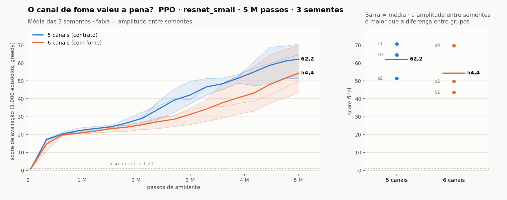

# O canal de fome valeu a pena?

**Resposta curta: não.** Com três sementes de cada lado, a observação de 6 canais terminou
**7,8 pontos abaixo** da de 5, ficou atrás em 17 dos 18 pontos de avaliação, e o mecanismo
que justificava o canal — reduzir a morte por inanição — **não apareceu**. A diferença não
é estatisticamente distinguível de ruído, mas o sinal, tal como é, aponta na direção
errada, e o canal cobra um preço fixo: a execução sai da arena.



## O que foi comparado

Uma ablação de uma variável só. Tudo o mais é idêntico — não "parecido":

| | 01 (contrato) | 97 (canal de fome) |
|---|---|---|
| observação | 5 canais egocêntricos | **6 canais** (`fome / limite_de_fome`) |
| rede | `resnet_small`, 180.464 params | `resnet_small`, 180.896 params |
| PPO | 512 envs × 96, lr 3e-4→5e-5, ent 0,02→0,002, GAE 0,95, clip 0,2, KL 0,03, 3 épocas × 8 minilotes | idêntico |
| shaping | 0,5 decaindo até 25% do treino | idêntico |
| orçamento | 5.000.000 passos de ambiente | idêntico |
| avaliação | 1.000 episódios, greedy, `seed=123` | idêntico |
| sementes | 0, 1, 2 | 0, 1, 2 |
| plataforma | Kaggle P100, TF 2.20 / Keras 3.13 | idêntico |

Registros em `runs/ppo/resnet_small/seed{0,1,2}` e `runs/ppo/resnet_small_fome_esparso/seed{0,1,2}`.

## O resultado

| execução | score final | mediana | p95 | máx | tabuleiro cheio | morte por fome |
|---|---:|---:|---:|---:|---:|---:|
| `ppo` seed0 | 64,56 | 71 | 80 | 87 | 0,0% | 1,9% |
| `ppo` seed1 | 70,58 | 79 | 97 | 97 | 13,1% | 2,9% |
| `ppo` seed2 | 51,43 | 60 | 65 | 70 | 0,0% | 4,7% |
| **`ppo` média** | **62,19** | 70,0 | — | — | 4,4% | **3,2%** |
| `resnet_small_fome` seed0 | 69,73 | 78 | 97 | 97 | 16,5% | 0,3% |
| `resnet_small_fome` seed1 | 49,78 | 52 | 75 | 97 | 0,1% | 9,0% |
| `resnet_small_fome` seed2 | 43,61 | 48 | 60 | 74 | 0,0% | 0,1% |
| **`resnet_small_fome` média** | **54,38** | 59,3 | — | — | 5,5% | **3,1%** |

Piso aleatório: 1,21. Score perfeito no 10×10: 97.

## Três leituras que importam mais que a média

**1. A curva inteira, não só o fim.** A média de 6 canais fica abaixo da de 5 em **17 dos
18** pontos de avaliação (o 18º, em 49 mil passos, é empate em 0,59 — ruído puro). O pior
momento é em 3,29 M passos, **12,4 pontos** atrás. Um resultado final ruim pode ser azar de
uma semente; uma curva que fica atrás o tempo todo, nas três, é outra coisa. E o atraso
aparece também em eficiência de amostra: para chegar a score 40 o contrato precisou de
2,78 M passos em média, o canal de fome precisou de **4,11 M** — 47% a mais.

**2. O mecanismo não funcionou.** O canal existia para uma hipótese específica: a cobra não
enxerga o relógio de inanição, então morre de fome sem ter como evitar. Se a hipótese
estivesse certa, a fração de mortes por fome cairia. Ela não caiu: **3,2% contra 3,1%**,
empate. E o pior caso de inanição de todas as seis execuções é justamente uma de 6 canais
(`resnet_small_fome` seed1, com 9,0%). O que a seed0 sugeria — 0,3% contra 1,9% — era uma semente,
não um efeito.

**3. A variância entre sementes é maior que tudo.** A amplitude é de 19,1 pontos no
contrato e 26,1 no canal de fome; a diferença entre os grupos é 7,8. As duas melhores
execuções das seis estão empatadas na prática e são uma de cada lado — 70,58 com 5 canais e
69,73 com 6 —, e as faixas se sobrepõem de 51,4 a 69,7, quase toda a extensão de ambas. É
por isso que o painel da direita do gráfico mostra os pontos individuais e não só a média:
uma conclusão tirada de uma semente só teria dado respostas opostas conforme a semente
sorteada — foi exatamente o que aconteceu quando só a seed0 existia.

## O que a estatística permite afirmar

Quase nada, e isso é parte da conclusão:

* diferença observada: **−7,81** (t de Welch = −0,81; permutação exata: p = 0,40);
* desvio combinado entre sementes: **11,88**;
* com 3 sementes por grupo, a permutação exata tem 20 arranjos — o **menor p possível é
  0,10**. O desenho não consegue produzir significância a 5% nem no melhor caso;
* o menor efeito detectável com n=3 (80% de poder) é de **±27 pontos**. Nada menor que isso
  é visível aqui;
* para resolver a diferença observada de 7,8 pontos seriam necessárias **~37 sementes por
  grupo** — cerca de 30 horas de P100 só nesta pergunta.

Ou seja: não dá para dizer que 6 canais é pior *com significância*. Dá para dizer que **não
há nenhuma evidência de que seja melhor**, e que descobrir a verdade custaria dez vezes o
que o canal poderia render.

## O custo, que é certo mesmo quando o ganho não é

* **Comparabilidade.** `comparable=False` por construção: a entrada da rede mudou, e
  nenhuma curva de 6 canais divide eixo com uma de 5. As três execuções não entram na
  arena, não entram no `RESULTADOS.md`, não viram baseline de nada. Ver
  [COMPARABILITY.md](COMPARABILITY.md).
* **Tempo:** 1.455 s contra 1.486 s de média — sem diferença real (a variação entre
  execuções da mesma família é maior que a variação entre famílias).
* **Tamanho:** +432 parâmetros, irrelevante.

O custo real, portanto, não é computacional: é que a execução não pode ser comparada com
nada do repositório. Um ganho de 7,8 pontos justificaria pagar isso; um déficit de 7,8, não.

## Veredito

**Não vale a pena manter o canal de fome ligado.** O `canal_fome` continua no código —
`VecSnake(canal_fome=True)`, `PPOConfig(canal_fome=True, comparable=False, caveat=...)` —
porque a ablação é um resultado e resultados negativos precisam ser reprodutíveis. Mas ele
fica desligado por padrão, e o contrato segue sendo 5 canais.

Se um dia a pergunta voltar, ela volta melhor formulada. Duas hipóteses do porquê o canal
atrapalhou, que valem mais que repetir o experimento igual:

* **O sinal é redundante.** O canal de comprimento já cresce junto com o corpo, e o limite
  de fome é função do comprimento. A rede talvez já inferisse o essencial, e o sexto canal
  só acrescentou uma entrada a normalizar durante o transiente inicial — que é exatamente
  onde a curva de 6 canais mais perdeu.
* **O canal muda de significado durante o treino.** `fome / limite` é uma razão cujo
  denominador cresce com a cobra. No início do treino ele satura perto de 1 com frequência;
  no fim, quase nunca. Uma entrada cuja distribuição se desloca ao longo do treino é
  material para instabilidade, e a amplitude maior entre sementes (26,1 contra 19,1) é
  consistente com isso.

Um teste mais barato que 37 sementes: manter os 5 canais e dar a informação de fome **fora
da observação espacial** — um escalar concatenado depois do tronco convolucional. Isso
mantém a entrada da CNN dentro do contrato e testa a hipótese sem pagar a
incomparabilidade inteira. Continua `comparable=False`, mas o tronco fica idêntico e a
comparação com o baseline volta a ser quase limpa.

## Reprodução

```bash
python - <<'PY'
import json, numpy as np
for v in ("resnet_small_esparso", "resnet_small_fome_esparso"):
    s = [json.load(open(f"runs/ppo/{v}/seed{i}/history.json"))["final"]["score_mean"]
         for i in range(3)]
    print(v, [round(x, 2) for x in s], "média", round(np.mean(s), 2))
PY
```

O gráfico sai de `tools/fig_canal_de_fome.py`, que lê os mesmos `history.json` — nenhum
número deste documento foi digitado à mão.

## Nota de manutenção

Estas execuções revelaram três defeitos, os três já corrigidos:

* `evaluate()`, o GIF e o exportador construíam a observação a partir da **constante** de 5
  canais, e não do ambiente/modelo. O treino de 6 canais quebrava na primeira avaliação, e
  depois de novo na exportação — sempre com uma mensagem sobre formas que não menciona
  canal de fome. Ver `snakeai/eval.py`, `snakeai/env/render.py` e `snakeai/export.py`.
* O `env_spec` do registro era uma cópia do contrato, então os três `history.json` de
  `resnet_small_fome` afirmam `n_channels: 5` — **o arquivo mentia sobre a própria observação**.
  Agora o `env_spec` é montado a partir do ambiente que rodou. Os registros já gravados
  mantêm o valor antigo; o `caveat` deles diz a verdade.
* As seis execuções tinham a **mesma identidade** no registro: `algo: "ppo"`,
  `variant: "resnet_small"`, sementes 0, 1 e 2. O que as separava era o nome da pasta e o
  `comparable=False` — mas `load_all` agrupa por `(algo, variant, seed)`, não por caminho,
  então bastava alguém marcar estas execuções como comparáveis para elas se fundirem às do
  contrato em vez de virar série própria. Proteção por acidente. Agora o `AgentBase`
  acrescenta o sufixo `_fome` à variante quando `canal_fome` está ligado, e estas três
  execuções foram remarcadas como `ppo/resnet_small_fome/seed{0,1,2}`.
