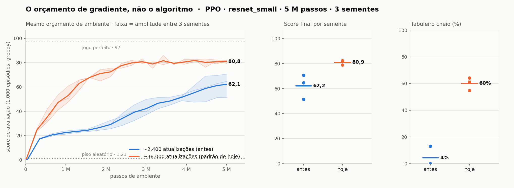

# O orçamento de gradiente

**O número de atualizações de gradiente vale ~18,7 pontos de score — e vale o mesmo nas
duas famílias em que foi medido, apesar de a razão entre os braços diferir por um fator de
cinco.** No PPO, 16× mais atualizações levaram de 62,19 a 80,90; no A2C, 3,2× mais levaram
de 52,22 a 70,93. Nenhuma linha do ambiente, da observação, da rede ou do protocolo de
avaliação foi tocada em nenhum dos dois.

Três resultados saem daqui, em ordem de força: o efeito existe e é grande nas duas famílias;
a explicação que registramos para ele em 2026-08-20 **não sobreviveu à réplica**; e o
orçamento de gradiente, uma vez declarado, separa as execuções do repositório em *saturadas*
e *limitadas por orçamento* — o que muda como a comparação principal do artigo deve ser
lida.



## O que foi comparado

Uma variável, com os dois braços em três sementes cada:

| | esparso (o padrão até agosto) | denso (o padrão de hoje) |
|---|---:|---:|
| `rollout` | 96 | 32 |
| `epochs` × `minibatches` | 3 × 8 | 4 × 32 |
| amostras por iteração | 49.152 | 16.384 |
| tamanho do minilote | 6.144 | 512 |
| iterações em 5 M passos | ~102 | ~305 |
| **atualizações de gradiente** | **~2.400** | **~38.300** |
| tempo de parede | 0,41 h | 0,83 h |

Tudo o mais idêntico: `num_envs=512`, γ 0,995, GAE(λ) 0,95, clip 0,2, entropia 0,02→0,002,
`lr` 3e-4→5e-5, KL alvo 0,03, `resnet_small` com 180.464 parâmetros, 5 M passos, avaliação
com 1.000 episódios greedy na semente 123.

Registros em `runs/ppo/resnet_small_esparso/seed{0,1,2}` (antes) e `runs/ppo/resnet_small/seed{0,1,2}` (padrão de hoje).

## O resultado

| execução | score final | mediana | tabuleiro cheio | melhor ckpt | pico em |
|---|---:|---:|---:|---:|---:|
| esparso seed0 | 64,56 | 71 | 0,0% | 62,72 | 95% |
| esparso seed1 | 70,58 | 79 | 13,1% | 69,46 | 95% |
| esparso seed2 | 51,43 | 60 | 0,0% | 51,23 | 95% |
| **esparso média** | **62,19** | 70 | **4,4%** | — | — |
| denso seed0 | 81,50 | 97 | 61,4% | 85,86 | 68% |
| denso seed1 | 78,87 | 97 | 54,7% | 81,98 | 84% |
| denso seed2 | 82,32 | 97 | 64,1% | 81,41 | 89% |
| **denso média** | **80,90** | 97 | **60,1%** | — | — |

## Três leituras, em ordem de importância

**1. A mediana bate no teto.** Nas três sementes densas a mediana é **97** — mais da metade
dos episódios são jogos perfeitos. A média de 80,90 não mede mais "quão bem o agente joga";
ela é essencialmente uma função da taxa de vitória, porque o teto está saturado. Daqui para
cima, a métrica que discrimina é `tabuleiro cheio`, e a média vira um resumo enganoso.

**2. A dispersão colapsou — no PPO.** Desvio padrão de 9,79 no esparso contra **1,80** no
denso, uma razão de 5,4. Amplitude de 19,15 contra 3,45. Para quem reproduz, isto é mais
útil que o ganho de média: uma execução do PPO no orçamento esparso não é uma medida do
algoritmo, é uma amostra de uma distribuição larga.

A explicação que registramos na primeira versão deste documento era geral — "no orçamento
esparso cada atualização carrega muito peso e o destino final depende de onde a trajetória
caiu; com passos pequenos e numerosos, a média emerge". **A réplica no A2C derrubou essa
generalização**, e a seção "O que a réplica derruba" trata disso. O fato empírico do PPO
continua de pé; a explicação não se estende à outra família.

**3. A separação é completa.** A pior semente densa (78,87) supera a melhor do esparso
(70,58) por 8,3 pontos. Num teste de permutação exato com 3×3, separação completa dá
p = 0,10 bilateral — que é o **menor valor que este desenho pode produzir**, e não um sinal
fraco. Perseguir p < 0,05 exigiria mais sementes; o que sustenta a conclusão aqui é a
magnitude (+18,71 pontos, +55,7 pontos percentuais de vitória) contra um ruído entre
sementes de 1,80.

## Duas observações que o experimento não previa

**O crítico estava saudável o tempo todo.** A variância explicada fica entre 0,88 e 0,96
nas três sementes densas. A suspeita registrada na revisão (§2.2) — de que o `vf_clip` em
unidades absolutas travava o crítico — **não se confirma neste orçamento**. A explicação
econômica é que as duas suspeitas eram a mesma: o clip limita o valor a ±0,2 por
atualização, e com 128 atualizações por iteração em vez de 24 ele deixa de morder. Fica
como hipótese não testada para o orçamento esparso, cujas execuções não registram `ev` —
com a ressalva que a réplica no A2C acrescenta, mais abaixo.

**Em duas de três sementes a política piorou no fim.** Seed 0 caiu de 85,86 (68% do
orçamento) para 81,50, com o tabuleiro cheio indo de 74,1% para 61,4%; seed 1 caiu 3,11
pontos; seed 2 não caiu. Nas que caíram, a entropia terminou em ~0,138 de um máximo de
1,099, o `clipfrac` desabou para 0,03 e a KL medida para 0,003 — o último terço endurece a
política em vez de melhorá-la, e a versão endurecida joga pior o final de partida, que é
onde o agente precisa de flexibilidade para não se fechar no próprio corpo. O agendamento
de entropia e de `lr` é o suspeito, e é um experimento próprio.

Sobra folga, aliás: a KL medida fica de 2 a 10 vezes abaixo do alvo de 0,03, e o early-stop
por KL só corta épocas em 3% a 5% das iterações. O orçamento efetivo é o nominal, e os
passos ainda são conservadores.

## O que isto obriga

O contrato fixa os passos de ambiente e se cala sobre as atualizações — que variam por um
fator de **64** entre os algoritmos do repositório:

| execução | atualizações | origem do número |
|---|---:|---|
| ACKTR | ~610 | analítico (as execuções são anteriores ao contador) |
| A2C esparso | **611** | medido, `meta["atualizacoes"]` |
| A2C denso | **1.954** | medido |
| PPO esparso | ~2.424 | analítico |
| PPO denso | **38.273** | medido |
| DQN | **38.908** | medido |

Depois deste resultado, comparar algoritmos sem declarar esse eixo mede orçamento de
otimização, não algoritmo.

Igualar não é possível: A2C e ACKTR fazem uma atualização por rollout **por definição**, e
o teto estrutural deles fica perto de 10.000 sem descaracterizar o método. A regra
defensável é **declarar e estreitar**: cada algoritmo recebe o maior orçamento que a sua
definição permite, o número vai para `meta["atualizacoes"]` de cada execução, e a coluna
aparece na tabela. Disparidade reportada é informação; disparidade silenciosa é confundidor.

## A réplica no A2C

O resultado acima vem de uma família só, e no PPO o botão do orçamento é na verdade três
(`rollout`, `epochs`, `minibatches`) girados juntos. O A2C serve de réplica com **uma
variável**: ele não tem épocas nem minilotes para reaproveitar o rollout, então mudar
`rollout` muda o número de atualizações.

| | esparso | padrão de hoje |
|---|---:|---:|
| `rollout` | 16 | 5 |
| amostras por atualização | 8.192 | 2.560 |
| **atualizações em 5 M passos** | **611** | **1.954** |

O 5 não é escolha de conveniência: é o `t_max` canônico do A3C, o valor do artigo original.
O 16 era o que estava no repositório antes de o orçamento virar eixo declarado. Os dois
braços saem de `04_a2c` (padrão) e `95_a2c_orcamento_esparso` (controle), que fixa
`A2CConfig.esparso()`.

**A previsão foi registrada antes de qualquer medição** e está no histórico deste arquivo:
que o efeito no A2C fosse *menor* que no PPO, porque a razão entre os braços é de 3,2×
contra 16× lá.

### O resultado

| execução | score final | mediana/ep | tabuleiro cheio | fome | inclinação final | pico em |
|---|---:|---:|---:|---:|---:|---:|
| esparso seed0 | 55,47 | 59 | 0,0% | 44,6% | +12,87 | 100% |
| esparso seed1 | 53,60 | 60 | 0,0% | 11,3% | +10,48 | 100% |
| esparso seed2 | 47,59 | 55 | 0,0% | 4,1% | +8,59 | 100% |
| **esparso média** | **52,22** | — | **0,0%** | 20,0% | **+10,64** | — |
| denso seed0 | 75,44 | 81 | 2,5% | 1,4% | +11,31 | 100% |
| denso seed1 | 69,61 | 77 | 0,3% | 0,9% | +11,67 | 90% |
| denso seed2 | 67,73 | 76 | 2,2% | 0,3% | +3,34 | 90% |
| **denso média** | **70,93** | — | **1,7%** | 0,9% | **+8,77** | — |

Desvio padrão: **4,11** no esparso, **4,02** no denso. Separação completa entre os braços
(a pior densa, 67,73, supera a melhor esparsa, 55,47, por 12,26 pontos), o que num teste de
permutação exato 3×3 dá p = 0,10 bilateral — o menor valor que este desenho produz, igual
ao do PPO.

### A previsão falhou, e é esse o achado

| | esparso → denso | razão de atualizações | efeito | desvio padrão |
|---|---|---:|---:|---|
| PPO | 62,19 → 80,90 | 16× | **+18,71** | 9,79 → 1,80 |
| A2C | 52,22 → 70,93 | 3,2× | **+18,70** | 4,11 → 4,02 |

Dezoito vírgula sete nos dois braços. A coincidência na segunda casa decimal é sorte; a
igualdade na ordem de grandeza, com uma razão de orçamento **cinco vezes menor**, não é.
A previsão registrada — efeito proporcionalmente menor no A2C — está errada, e vale mais
publicada do que apagada: é o tipo de erro que um pré-registro existe para tornar visível.

### O que a réplica derruba

**A explicação da dispersão não é geral.** No PPO o desvio cai 5,4× do esparso para o denso.
No A2C ele não se mexe: 4,11 → 4,02. Se o mecanismo fosse "poucas atualizações, cada uma
pesando muito, destino refém da trajetória", ele deveria aparecer com mais força no A2C, que
opera com um décimo das atualizações do PPO. Não aparece. O colapso de dispersão é uma
propriedade do PPO — o suspeito natural é o reaproveitamento de rollout, que o A2C não tem —
e não do orçamento de gradiente.

**A explicação por "posição numa curva comum" também não sobrevive.** A leitura tentadora
para o efeito idêntico é que existe uma única curva de retornos decrescentes e que o A2C
opera na parte íngreme (611 e 1.954 atualizações) enquanto o PPO opera na parte achatada
(2.424 e 38.273). O ACKTR refuta isso sozinho:

| execução | atualizações | score | inclinação final | picos |
|---|---:|---:|---:|---|
| A2C esparso | 611 | 52,22 | **+10,64** | 100 / 100 / 100% |
| ACKTR | ~610 | 79,52 | **+0,77** | 76 / 87 / 97% |

Mesmo número de atualizações. Vinte e sete pontos de diferença, e regimes opostos: o A2C
ainda sobe forte com as três sementes picando no fim do orçamento, o ACKTR já saturou. Se
houvesse uma curva só, esses dois pontos estariam no mesmo lugar dela.

**A conclusão honesta é que não temos o mecanismo.** Temos o efeito, replicado em duas
famílias, com o tamanho medido nas duas; e temos duas explicações candidatas descartadas
pelos próprios dados. Escrever isso é mais defensável do que escolher a terceira explicação
que ainda não foi testada.

## Saturação e limitação por orçamento

O eixo de orçamento produziu, de graça, uma segunda leitura: **quais execuções terminam os
5 M passos ainda subindo**. A inclinação abaixo é a regressão linear do último terço da
curva de avaliação, em pontos por milhão de passos.

| execução | atualizações | inclinação final | picos por semente | regime |
|---|---:|---:|---|---|
| A2C esparso | 611 | **+10,64** | 100 / 100 / 100% | limitado por orçamento |
| PPO esparso | ~2.424 | **+10,15** | 100 / 100 / 100% | limitado por orçamento |
| A2C denso | 1.954 | **+8,77** | 100 / 90 / 90% | limitado por orçamento |
| DQN | 38.908 | +3,34 *(n=2)* | 95 / 75% | indefinido |
| ACKTR | ~610 | +0,77 | 76 / 87 / 97% | saturado |
| PPO denso | 38.273 | +0,64 | 68 / 84 / 100% | saturado |

Duas consequências para o artigo.

**A comparação PPO × A2C a 5 M passos é um limite superior da distância algorítmica.** O PPO
denso saturou — em duas de três sementes ele termina *abaixo* do próprio pico. O A2C não
saturou em nenhum dos dois braços. Estender o orçamento estreitaria a distância por
construção, e o número que o artigo publica precisa dizer isso em vez de esperar a pergunta.

**O ACKTR satura com 610 atualizações.** É a única execução do repositório que atinge o
regime de saturação com o menor orçamento de gradiente medido. Isso não é um detalhe de
implementação: é o gradiente natural fazendo o que o artigo do K-FAC promete, e é a
observação de maior densidade do repositório inteiro.

## O eixo entre famílias

Uma vez que o orçamento de gradiente é declarado por execução, ele pode ser lido como
denominador. Pontos de score por mil atualizações:

| execução | atualizações | score | pontos por 1k atualizações | horas |
|---|---:|---:|---:|---:|
| ACKTR | ~610 | 79,52 | **130,4** | 0,51 |
| A2C esparso | 611 | 52,22 | 85,5 | 0,42 |
| A2C denso | 1.954 | 70,93 | 36,3 | 0,31 |
| PPO esparso | ~2.424 | 62,19 | 25,7 | 0,41 |
| PPO denso | 38.273 | 80,90 | 2,1 | 0,83 |
| DQN | 38.908 | 47,67 *(n=2)* | 1,2 | 1,85 |

O ACKTR chega a 79,52 com **1,6% do orçamento de gradiente do PPO**, empata com ele dentro
do ruído entre sementes (80,90 contra 79,52) e gasta 0,51 h contra 0,83 h de parede. A
ressalva obrigatória é a dispersão: ±19,11 de amplitude no ACKTR contra ±3,45 no PPO. Ele
tem a melhor semente do repositório (89,78) e uma das piores das duas famílias (70,67).
Média e desvio contam histórias diferentes aqui, e as duas precisam aparecer.

**O par PPO × DQN é o único do repositório com o orçamento de gradiente casado.** 38.273
contra 38.908 atualizações — uma diferença de 1,7%, dentro do ruído de contagem. É a única
comparação entre algoritmos que este benchmark oferece hoje **sem** o confundidor de
orçamento, e ela dá 80,90 contra 47,67. Vale marcar assim no artigo: as outras comparações
medem algoritmo *mais* orçamento; esta mede algoritmo.

## Um mecanismo lateral: eficiência de passos e morte por fome

O ambiente mata por inanição depois de `starve_base = 100` passos sem comida. Isso liga duas
métricas que pareciam independentes — quantos passos o agente gasta por maçã, e como ele
morre:

Todas as colunas abaixo são **médias entre as sementes** — a arena
(`RESULTADOS.md`) reporta mediana, então os números não batem casa a casa de propósito:
ACKTR dá 64,7% de tabuleiro cheio em média e 60,7% em mediana, e os dois estão certos.

| execução | passos por maçã | morte por fome | morte por colisão | tabuleiro cheio |
|---|---:|---:|---:|---:|
| PPO denso | 9,78 | 0,1% | 39,8% | 60,1% |
| ACKTR | 11,93 | 0,6% | 34,7% | 64,7% |
| PPO esparso | 16,09 | 3,2% | 92,5% | 4,4% |
| A2C denso | 16,54 | 0,9% | 97,5% | 1,7% |
| A2C esparso | 19,20 | **20,0%** | 80,0% | 0,0% |

Nos extremos a relação é limpa: quem gasta menos de 12 passos por maçã praticamente não
morre de fome, e o A2C esparso — o menos eficiente do repositório — é o único em que a
inanição vira causa dominante numa semente (44,6% na seed 0). No meio a relação se solta:
o A2C denso e o PPO esparso gastam quase o mesmo por maçã (16,54 e 16,09) com 0,9% e 3,2% de
fome. A média de passos por maçã não determina a inanição; o que mata é a **cauda** da
distribuição, e a média é só um indicador dela.

Vale também para ler a causa de morte com cuidado. Condicionado a **não** vencer, todos os
agentes fortes morrem de colisão em ~99% dos casos — PPO 99,5%, ACKTR 99,0%, A2C denso
98,6%. Uma taxa alta de colisão não é sinal de política agressiva; é o que sobra quando a
inanição some. O outlier é o A2C esparso, com 55,4% de colisão condicional na seed 0: a
timidez do braço esparso, não a ousadia do denso, é o que precisa de explicação.

## Reprodução

```bash
python - <<'PY'
import json, numpy as np
for v in ("resnet_small_esparso", "resnet_small"):
    s = [json.load(open(f"runs/ppo/{v}/seed{i}/history.json"))["final"]["score_mean"]
         for i in range(3)]
    print(v, [round(x, 2) for x in s], "média", round(np.mean(s), 2),
          "dp", round(np.std(s, ddof=1), 2))
PY
```

Trocando `ppo` por `a2c` no bloco acima sai a réplica, com os mesmos seis registros.

As duas colunas derivadas deste documento — inclinação final e pontos por mil atualizações —
saem daqui:

```bash
python - <<'PY'
import glob, json
import numpy as np
for pad in ("runs/ppo/resnet_small", "runs/ppo/resnet_small_esparso",
            "runs/acktr/resnet_small", "runs/a2c/resnet_small",
            "runs/a2c/resnet_small_esparso", "runs/dqn/base"):
    sc, incs, ats = [], [], []
    for f in sorted(glob.glob(pad + "/seed*/history.json")):
        d = json.load(open(f))
        sc.append(d["final"]["score_mean"])
        c = d["config"]
        # o contador entrou depois do ACKTR e do PPO esparso: para eles o número é
        # analítico, e precisa incluir épocas x minilotes ou sai 16x menor
        ats.append(d["meta"].get("atualizacoes")
                   or (c["total_steps"] // (c["num_envs"] * c["rollout"])
                       * c.get("epochs", 1) * c.get("minibatches", 1)))
        vistos, ev = set(), []
        for pt in d["curve"]:                      # a curva repete o último ponto
            if "eval_score_mean" in pt and pt["global_step"] not in vistos:
                vistos.add(pt["global_step"])
                ev.append((pt["global_step"], pt["eval_score_mean"]))
        t = ev[len(ev) * 2 // 3:]                  # o último terço
        incs.append(np.polyfit([s / 1e6 for s, _ in t], [v for _, v in t], 1)[0])
    at = int(np.mean(ats))
    print(f"{pad:34s} n={len(sc)} score={np.mean(sc):6.2f} atualizações={at:6d} "
          f"pts/1k={1000 * np.mean(sc) / at:6.1f} inclinação={np.mean(incs):+6.2f}")
PY
```

O gráfico sai de `tools/fig_orcamento.py`, que lê os mesmos `history.json`.

## Histórico deste documento

* **2026-08-20** — versão original, só com o PPO. Registrou a previsão de que o efeito no
  A2C seria menor, e a explicação do colapso de dispersão como propriedade geral do
  orçamento esparso.
* **2026-08-21** — réplica no A2C fechada com três sementes por braço. A previsão falhou
  (+18,70 contra +18,71) e a explicação da dispersão não replicou. Acrescentadas as seções
  de saturação, do eixo entre famílias e do mecanismo de fome. As duas afirmações
  derrubadas ficam no texto, marcadas — não foram apagadas.
