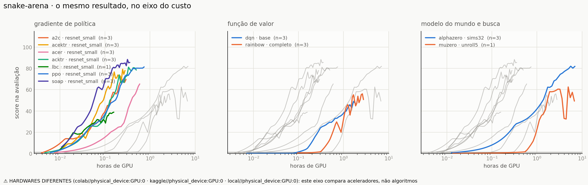
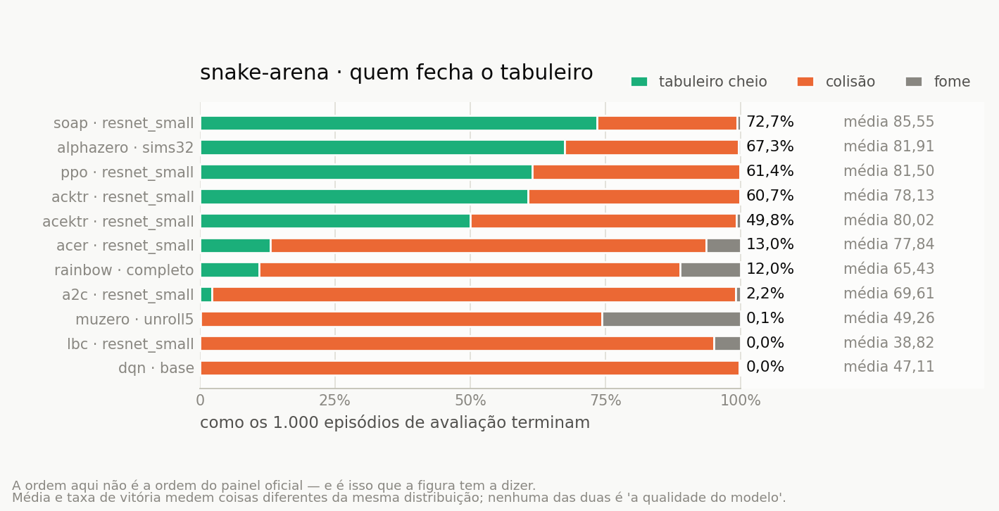
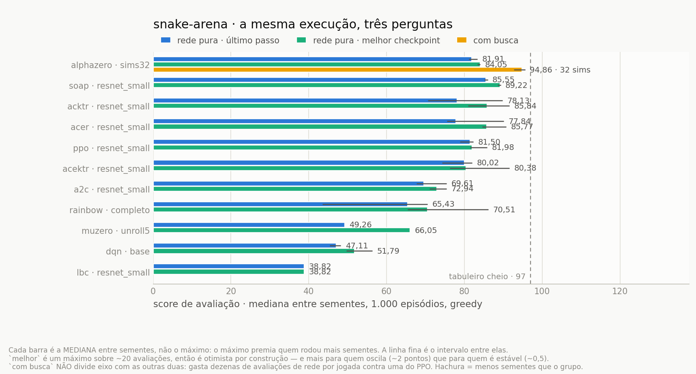

# Resultados

Gerado por `python -m snakeai.arena --all`. Não editar à mão.

O gráfico mostra o **braço principal** de cada algoritmo — o que o notebook roda na
configuração padrão. A tabela abaixo mostra **tudo**, ablações inclusive: a figura
responde *quem vai mais longe com os mesmos dados*, e uma ablação desenhada ao lado
do próprio controle, na mesma cor, responde outra pergunta.

| algoritmo | rede | params | sementes | passos | score (last) | melhor ckpt | com busca | passos até 40 | horas | amplitude | mediana/ep | máx | cheio |
|---|---|---|---:|---:|---:|---:|---:|---:|---:|---:|---:|---:|---:|
| _piso aleatório_ | — | — | — | 0 | **1,21** | — | — | — | — | — | 1 | — | 0% |
| soap · resnet_small | `resnet_small` | 300,036 | 3 | 5,013,504 | **85.55** | 89.22 | — | 753,664 | 0.4 | ±0.89 | 97 | 97 | 72.7% |
| alphazero · sims32 | `resnet_small` | 180,464 | 3 | 5,000,192 | **81.91** | 84.05 | 94.86 (32 sims) | 750,592 | 7.1 | ±2.20 | 97 | 97 | 67.3% |
| ppo · resnet_small | `resnet_small` | 180,464 | 3 | 5,013,504 | **81.50** | 81.98 | — | 802,816 | 0.9 | ±3.45 | 97 | 97 | 61.4% |
| acektr · resnet_small | `resnet_small` | 180,464 | 3 | 5,005,312 | **80.02** | 80.38 | — | 1,507,328 | 0.3 | ±7.71 | 96 | 97 | 49.8% |
| acktr · resnet_small | `resnet_small` | 180,464 | 3 | 5,005,312 | **78.13** | 85.84 | — | 1,277,952 | 0.5 | ±19.11 | 97 | 97 | 60.7% |
| acer · resnet_small | `resnet_small` | 334,878 | 3 | 5,001,216 | **77.84** | 85.77 | — | 1,251,328 | 1.4 | ±14.53 | 86 | 97 | 13.0% |
| acktr · resnet_small+kl_nominal_momento_descontado | `resnet_small` | 180,464 | 1 | 5,002,240 | **76.45** | 76.45 | — | 2,501,120 | 0.2 | ±0.00 | 86 | 97 | 22.3% |
| acektr · resnet_small+base50+s_ema | `resnet_small` | 180,464 | 1 | 5,005,312 | **74.47** | 74.47 | — | 1,507,328 | 0.4 | ±0.00 | 82 | 97 | 0.4% |
| acktr · resnet_small+kl_cal_debias_definitiva | `resnet_small` | 180,464 | 2 | 5,005,312 | **74.20** | 84.34 | — | 1,380,352 | 0.3 | ±9.67 | 90 | 97 | 55.2% |
| acktr · resnet_small+kl0.002 | `resnet_small` | 180,464 | 1 | 5,005,312 | **72.50** | 74.19 | — | 2,547,712 | 0.5 | ±0.00 | 75 | 97 | 28.9% |
| acektr · resnet_small+kl_cal_v1+s_ema_T5 | `resnet_small` | 180,464 | 1 | 5,002,240 | **71.07** | 71.07 | — | 1,500,160 | 0.4 | ±0.00 | 78 | 97 | 17.6% |
| a2c · resnet_small | `resnet_small` | 180,464 | 3 | 5,002,240 | **69.61** | 72.94 | — | 2,501,120 | 0.3 | ±7.72 | 77 | 97 | 2.2% |
| rainbow · completo | `resnet_small` | 1,196,648 | 3 | 5,000,192 | **65.43** | 70.51 | — | 2,250,240 | 4.0 | ±27.01 | 77 | 97 | 12.0% |
| ppo · resnet_small_esparso | `resnet_small` | 180,464 | 3 | 5,013,504 | **64.56** | 62.72 | — | 2,703,360 | 0.4 | ±19.15 | 71 | 97 | 0.0% |
| acktr · resnet_small+kl_nominal+kl0.002 | `resnet_small` | 180,464 | 1 | 5,005,312 | **64.53** | 84.92 | — | 1,277,952 | 0.5 | ±0.00 | 69 | 97 | 26.7% |
| a2c · resnet_small_esparso | `resnet_small` | 180,464 | 3 | 5,005,312 | **53.60** | 53.60 | — | 4,005,888 | 0.3 | ±7.87 | 59 | 78 | 0.0% |
| muzero · unroll5 | `resnet_small` | 154,608 | 1 | 5,000,192 | **49.26** | 66.05 | — | 1,500,160 | 6.8 | ±0.00 | 57 | 97 | 0.1% |
| rainbow · completo+n3+sem_noisy+eps_greedy | `resnet_small` | 662,148 | 1 | 5,000,192 | **49.17** | 49.97 | — | 4,000,000 | 8.0 | ±0.00 | 49 | 90 | 0.0% |
| dqn · base | `resnet_small` | 333,475 | 3 | 5,000,192 | **47.11** | 51.79 | — | 3,500,032 | 1.9 | ±2.86 | 49 | 89 | 0.0% |
| lbc · resnet_small+H_shaping+conc49_bala_de_prata | `resnet_small` | 286,896 | 2 | 5,013,504 | **43.09** | 50.71 | — | 2,637,824 | 0.3 | ±36.53 | 45 | 90 | 0.0% |
| lbc · resnet_small+H_shaping | `resnet_small` | 286,896 | 1 | 5,013,504 | **42.77** | 46.46 | — | 3,014,656 | 0.2 | ±0.00 | 44 | 59 | 0.0% |
| muzero · unroll5_normaliza_unroll | `resnet_small` | 154,608 | 1 | 5,000,192 | **42.70** | 62.59 | — | 1,750,016 | 6.6 | ±0.00 | 63 | 85 | 0.0% |
| muzero · unroll10+num_simulations32 | `resnet_small` | 154,608 | 1 | 5,000,192 | **42.22** | 54.68 | — | 2,750,464 | 9.7 | ±0.00 | 52 | 75 | 0.0% |
| lbc · resnet_small | `resnet_small` | 286,896 | 1 | 5,013,504 | **38.82** | 38.82 | — | não chegou | 0.2 | ±0.00 | 44 | 56 | 0.0% |
| alphazero · sims32_sem_correcoes | `resnet_small` | 180,464 | 1 | 5,000,192 | **10.62** | 13.03 | — | não chegou | 7.5 | ±0.00 | 5 | 44 | 0.0% |
| rainbow · completo+n3 | `resnet_small` | 1,196,648 | 1 | 5,000,192 | **0.57** | 0.78 | — | não chegou | 2.6 | ±0.00 | 0 | 6 | 0.0% |

Score perfeito no 10×10: **97**.

**passos até 40** é a curva lida na horizontal em vez da vertical: em vez de *quanto marcou no fim*, *quantos passos precisou para chegar lá*. Sai dos mesmos dados e responde à outra pergunta — menor é melhor. A resolução é a cadência de avaliação, e não há interpolação: o passo mostrado é um em que a medição de fato aconteceu. `(k/n)` significa que só `k` das `n` sementes chegaram, e as que não chegaram ficam **fora** da mediana em vez de entrar como um número inventado.

**horas** é tempo de parede da execução inteira, útil só entre execuções do mesmo hardware. O eixo de passos iguala os *dados vistos*; ele não iguala o *esforço*, e a diferença entre os dois é enorme para quem faz busca em árvore.

A coluna **score (last)** é o número oficial: o modelo do último passo, que é o estado final do algoritmo. O valor é a **mediana entre as sementes** do score médio de cada uma — não a média entre elas. É a mesma estatística que o gráfico desenha como linha, com o intervalo entre sementes como faixa, e com três sementes ela é o que uma semente divergente não consegue arrastar. Os documentos de ablação (`ORCAMENTO_DE_GRADIENTE.md`, `CANAL_DE_FOME.md`) reportam **média e desvio**, porque lá a pergunta é o tamanho de um efeito, não a ordem de um ranking: os dois números convivem, e cada um diz qual é. **mediana/ep** é outra coisa ainda — a mediana entre *episódios*, não entre sementes. **melhor ckpt** é o melhor que aquela execução produziu em algum momento — fica à parte porque premia quem foi medido mais vezes, pela mesma razão que a busca do AlphaZero e o filtro de flood-fill ficam fora da curva.

**com busca** é o agente medido com a máquina que ele de fato usa para jogar — a árvore do AlphaZero e do MuZero — no mesmo protocolo de 1.000 episódios. Ela fica numa coluna separada, e não na curva, porque **não divide eixo**: uma jogada com 32 simulações gasta dezenas de avaliações de rede contra uma do PPO, e desenhá-las juntas daria computação de graça a quem busca. `n=k` marca quantas sementes foram medidas sob o protocolo inteiro; medir com busca custa horas, então quase sempre é menos que o total. Medições parciais — menos episódios que o contrato, ou que estouraram o teto de tempo — ficam gravadas em `busca` e **não** aparecem aqui: uma amostra que acabou por tempo é enviesada para episódios curtos, que são justamente os ruins.

## O mesmo resultado, no eixo do custo

O gráfico acima iguala os **dados vistos**. Este iguala o **esforço gasto** — e a
ordem muda, porque um passo de AlphaZero custa uma busca em árvore inteira e um
de DQN custa uma passada de rede. São duas perguntas diferentes, e nenhuma das
duas é a resposta da outra.

## E no eixo de quem fecha o tabuleiro

A média e a taxa de vitória são dois funcionais da **mesma** distribuição —
`E[X]` e `P(X = 97)` — e não têm obrigação de concordar. O limiar joga fora tudo
abaixo do teto: um episódio de 96 conta igual a um de 3. A média joga fora o
formato: não distingue "sempre 78" de "metade perfeito, metade zero". **Quando
a ordem desta figura difere da ordem do gráfico oficial, é exatamente isso que
está acontecendo** — e nenhuma das duas é "a qualidade do modelo".

Por isso a barra não é a taxa de vitória sozinha: é a repartição inteira das
causas de fim, com a vitória como primeiro segmento. Ela mostra o que nenhum dos
dois números mostra — perder por fome e perder por colisão são fracassos
diferentes, e a curva de score é idêntica nos dois casos.

## Os melhores modelos nas suas melhores tentativas

Três perguntas sobre a **mesma** execução: como o algoritmo terminou (`final`,
que é o número oficial), o melhor que ele produziu em algum momento (`melhor`), e
o que você levaria para jogar (`com busca`). Cada barra é a **mediana entre
sementes** dentro do regime — o que varia entre elas é a pergunta, não a
estatística.

A tentação aqui é responder com um **máximo**: o maior número que qualquer
semente produziu em qualquer regime. Seria enviesado de um jeito específico e
evitável — o máximo cresce com o número de sorteios, então premia quem rodou mais
sementes, não quem é melhor. Comparar o máximo de três sementes com o de uma é
comparar 3 sorteios com 1.

O viés que sobra está escrito na figura: `melhor` é um máximo sobre os ~20 pontos
de avaliação da execução, então é otimista **por construção**, e não
uniformemente — com 1.000 episódios o erro padrão é `desvio/√1000`, que vale ~0,25
para o AlphaZero e ~0,88 para o MuZero. Quanto mais instável o algoritmo, mais o
`melhor` o favorece. Uma diferença de dois ou três pontos entre `final` e `melhor`
não significa nada; a queda de 42 pontos do `rainbow/completo/seed1` significa.

## Configurações com menos de 3 sementes

Entram no gráfico, mas **não sustentam comparação**: a amplitude entre
sementes do PPO neste ambiente é de 19 pontos, maior que quase toda
diferença entre algoritmos que a tabela mostra.

- `acektr/resnet_small+base50+s_ema`: 1 de 3 — faltam 2
- `acektr/resnet_small+kl_cal_v1+s_ema_T5`: 1 de 3 — faltam 2
- `acktr/resnet_small+kl0.002`: 1 de 3 — faltam 2
- `acktr/resnet_small+kl_cal_debias_definitiva`: 2 de 3 — faltam 1
- `acktr/resnet_small+kl_nominal+kl0.002`: 1 de 3 — faltam 2
- `acktr/resnet_small+kl_nominal_momento_descontado`: 1 de 3 — faltam 2
- `alphazero/sims32_sem_correcoes`: 1 de 3 — faltam 2
- `lbc/resnet_small`: 1 de 3 — faltam 2
- `lbc/resnet_small+H_shaping`: 1 de 3 — faltam 2
- `lbc/resnet_small+H_shaping+conc49_bala_de_prata`: 1 de 3 — faltam 2
- `muzero/unroll10+num_simulations32`: 1 de 3 — faltam 2
- `muzero/unroll5`: 1 de 3 — faltam 2
- `muzero/unroll5_normaliza_unroll`: 1 de 3 — faltam 2
- `rainbow/completo+n3`: 1 de 3 — faltam 2
- `rainbow/completo+n3+sem_noisy+eps_greedy`: 1 de 3 — faltam 2

## Execuções que não entraram na arena

Estão registradas em `runs/`, com curva e artefatos, mas não competem. O
motivo é conferido na hora de montar a arena, com esta versão do código —
não é o carimbo que ficou gravado no dia do treino. Execuções marcadas
`comparable=False` também aparecem aqui: elas não competem por construção,
e some-las seria pior do que incluí-las.

- `acktr/resnet_small_regua_antiga/seed0`: comparable=False: medida com o protocolo de avaliação anterior a 14/08: sem as chaves de causa de fim, com a maçã do episódio vencedor faltando (score_max 96 num tabuleiro cujo perfeito é 97) e com `win_rate` de outra fórmula. Mantida como registro histórico; a semente 0 na régua atual está em `acktr/resnet_small/seed0`.
- `dqn/base_antigo/seed0`: comparable=False: treinada antes da correção do truncamento por fome (§1.1 da revisão): a fome entrava no buffer como terminação e o `next_obs` gravado era o do episódio seguinte. 34,3% dos episódios finais terminaram por inanição — o sintoma que a correção ataca. Mantida como registro do 'antes'; refazer com o pacote corrigido.
- `lbc/resnet_small_antes_das_correcoes/seed0`: comparable=False: primeira execução do LBC, com os padrões anteriores às correções §2.6–§2.9 do docs/LBC.md: logits de comportamento sem padronização, sem região de confiança em volta do gradiente do IMPALA, coeficiente de entropia agendado e bandit decidindo sem evidência. A autópsia está na §2.10 — a softmax da política alvo saturou em 540 k passos (`ent` 5e-6, `entropia_comportamento` 6e-4, `razao_media` 1,0000) e a execução ficou 2,3 M de passos num ponto fixo absorvente, terminando em 0,57 ponto com 100% dos episódios encerrados por fome. Mantida como registro do 'antes'; o braço oficial do LBC sai de uma execução nova com o pacote corrigido.
- `ppo/resnet_small_fome_esparso/seed0`: comparable=False: observação com 6 canais (fome), fora do contrato de 5; orçamento de gradiente esparso (~2.400 atualizações), que era o padrão quando a ablação foi medida
- `ppo/resnet_small_fome_esparso/seed1`: comparable=False: observação com 6 canais (fome), fora do contrato de 5; orçamento de gradiente esparso (~2.400 atualizações), que era o padrão quando a ablação foi medida
- `ppo/resnet_small_fome_esparso/seed2`: comparable=False: observação com 6 canais (fome), fora do contrato de 5; orçamento de gradiente esparso (~2.400 atualizações), que era o padrão quando a ablação foi medida
